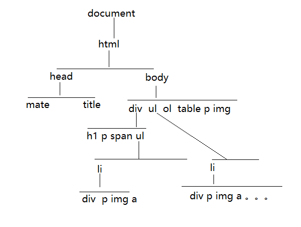

[TOC]

#第三天
##HTML的基本结构
一个HTML文件就是一个页面(网页)，也称作叫文档(document)

###`<!DOCTYPE html>` 文档声明
作用：定义这个文档声明，浏览器会先识别这句话，然后根据这个文档声明去解析我们的文档

> 文档声明必须放在页面的第一行(浏览器是从上到下加载的)
> 文档声明是一条声明语句，不是HTML标签(元素)
> 文档声明这条语句，不能删除，否则会发生诡异模式

```
<!DOCTYPE html>
html5声明文档

<!DOCTYPE HTML PUBLIC "-//W3C//DTD HTML 4.01 Transitional//EN"        "http://www.w3.org/TR/html4/loose.dtd">
HTML4声明文档
```
> 在工作中，一般常用的是html5的声明文档，因为高版本兼容低版本
> 

###HTML元素
告诉浏览器其自身是一个HTML文件(页面)



####`lang="en"`
因为让用户看的都是中文的，可以把这句话删掉

####head元素
由开始标签和结束标签加内容组成的，是页面的头部，自带一个CSS属性 display:none; (隐藏)

#####`meta`元素
- charset="UTF-8" 文档编码
	- UTF-8 国际  **常用**
	- GB2312 国标
- `name="keywords" content="关键字的内容"`
- `name="description" content="描述网站的一段话"`
> 关键字和描述是为网站优化(SEO优化、引擎搜索)

- `title` 标题
	- 一个HTML页面只能有一个标题
	- 标题在页面中页卡位置
	
####body元素
定义整个页面的主体部分，所有给用户展示的内容都在这个元素里面展示，HTML的常用元素:div img p ....

##CSS层叠样式表
- CSS的作用
- CSS和HTML如何融合一起
- 如何来获取HTML元素，把CSS样式添加给这个元素

CSS的作用：给HTML元素添加**静态**或者**动态**的样式

###CSS和HTML如何融合一起(CSS的引入方式-4种)   **面试题**
- 行内式：直接在标签(元素)的后面，加一个标签属性style进行引入
```
<div style="color:red;">div元素</div>
div 标签
style="color:red;" 标签属性
```
- 内嵌式：把CSS代码放在style元素内，通过CSS选择器来选择HTML元素，并将把这个CSS样式添加给这个元素
> style元素一般放在head元素中(title标题的后面)
```
<style>
	div{color:red;}
</style>
<div>div1</div>
<div>div2</div>
```
- 外链式：把CSS代码单独放一个CSS文件中，通过link标签引入到html元素中
> 外链式一般放在head元素中(title标题的下面)
> **外链式**在工作中最常用的
```
<link rel="stylesheet" href="style.css" type="text/css">
link 标签
rel="stylesheet" 样式表  不可缺少
href=""  CSS样式表的路径、地址
type="text/css" 类型，可以不写，但是建议写全
```
- 导入式：将CSS代码单独放在一个CSS文件中，通过style元素引入--**@import "CSS样式表的路径";**
> 导入式既不是HTML标签也不是CSS样式，它只是一条声明语句
```
<style>
   @import "style.css";
</style>
<div>div1</div>
<div>div2</div>
```
####外链式和导入式的区别   **面试题**
> link和@import虽然都是引入外部的css文件，但是他们是由天差地别的区别的

- link是html标签，@import完全是css提供的方式，要写在css文件或者style标签中。
- 他们的加载顺序也是有区别的，当一个页面被加载的时候，link引用的css文件会被同时加载，而@import引入的css文件会等页面全部下载完后再加载。
- 当使用javascript控制DOM去改变css样式的时候，只能使用link标签，因为import是不能被DOM控制的。

###CSS选择器
语法：css选择器{css属性名:css属性值;}

> css属性名和css属性值用**冒号(:)**隔开，用**分号(";")**结尾
```
h1{color:red;font-size:16px;}
```
####CSS选择器的分类
#####标签选择器
直接用HTML元素作为选择器来用
语法：标签名{css属性名:css属性值;}
权重：1
```
<style>
	div{color:red;font-size:16px;}
</style>
<div>div1</div>
<div>div2</div>
```

#####类选择器
HTML元素后面添加标签属性名(class)，用标签属性值当做选择器来用，在标签属性值前面加"."
语法：类选择器{css属性名:css属性值;}
权重：10
> 标签属性值(类名)可以重复使用
> 标签属性值(类名)一次可以出现多个，每个类名用**空格**隔开
```
<style>
div{
    color: red;
    font-size: 16px;
}
.div3{/*10*/
     font-size:50px;
}
.div2{/*10*/
    color: yellow;
    font-size: 20px;
}
</style>
<div>div1</div>
<div class="div2">div2</div>
<div class="div2 div3">div3</div>
```
#####id选择器
HTML元素后面添加标签属性名(id)，用标签属性值当做选择器来用，在标签属性值前面加"#"
语法：ID选择器{css属性名:css属性值;}
权重：100
> id选择器的标签属性值(id名)在页面中只能出现一次，因为id选择器具有唯一性
> 
> id选择器是结合JavaScript来使用的
```
<style>
	#div1{color:red;}
</style>
<div id="div1">div元素</div>
<div id="div1"></div><!--错误的-->
```
> 标签选择器相当于人的姓，类选择器相当于人的名，id选择器相当于人的身份证号

#####后代选择器(派生选择器)
在根元素的范围内，查找它的所有的后代元素
语法：祖辈选择器 后代选择器{css样式}
权重：所有选择器组合之和
```
<style>
    .div1 span{ 权重：11
        font-size: 40px;
        color: #faa770;
    }
    .div1 li span{}  权重：12
</style>

<div class="div1">
    <ul>
        <li>
            <span>1111</span>
        </li>
    </ul>
    <span>333333</span>
</div>

<div class="div2">
    <ul>
        <li>
            <span>2222</span>
        </li>
    </ul>
</div>

```
#####分组选择器
将同样的CSS样式，分别给不同的HTML元素添加样式
语法：选择器1,选择器2,选择器3{css样式}
权重：分组选择器是独立计算的，不会叠加
> 分组选择器之间用**逗号(",")**隔开
> css样式的**大括号"{}"**前面没有任何的符号
```
<style>
	div,p{color:red;}
</style>
<div>div元素</div>
<p>p元素</p>
```


