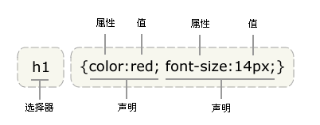

[TOC]

#第二天
##复习
- 前端三层
	- HTML 结构
	- CSS 样式
	- JS 交互、动态效果
- 小概念的总结
	- 网页：通俗来讲是一个HTML的文件
	- 网站：由多个网页组成的
	- 站群：由多个网站组成的，为同一家公司服务
	- 浏览器：谷歌浏览器最好用
- 网页的基本组成
	- HTML/CSS/JS
	- HTML(超文本标记语言)：除了文字，没有其他。如果遇到音视频、图片，需要用超文本(标签)引入，才能正常的显示在页面中
	- HTML特点：浏览器是从上到下解析的，如果遇到错误，HTML不会报错，也不会被指出
	- HTML兼容问题：由于浏览器是由不同厂商生产的，再解析HTML页面时，解析的效果不太一致，所以导致HTML的兼容问题
	- 超文本(标签)
		- 语法：由成对的尖括号和关键字组成的
			- 	`<div>`
		- 	关键字：不能随便瞎起的，已经是规范好的
		- 	标签属性：提供了HTML元素更多的信息
			- 	`<div title="zf" class="div1"></div>`
		- 	标签的分类：
				- 	开始标签`<div>`
				- 	结束标签`</div>`
				- 	空标签`<br/>`
			- 	HTML元素
				- 	由开始标签和结束标签加内容组成的
					- 	`<div>内容</div>`
				- 	``为了给元素添加功能的
	- 	HTML中常用的元素有哪些？
		- 	h1-h6 标题
		- 	ul 无序列表
			- 	li 列表项 默认前面有个小黑点
		- 	ol 有序列表
			- 	li 列表项 默认前面有个序号
		- 	dl 自定义列表
			- 	dt 标题，只能出现一次
			- 	dd 描述，可以出现多次
			- 	常用在页面的新闻、摘要、网页的尾部
		- 	p 段落
		- 	div  区分大模块
		- 	span 区分行内小模块
		- 	img 插入图片
			- 	src="" 图片的路径、地址
			- 	alt=""  图片的描述
		- 	a 超链接、锚点
			- 	href="" 网址、地址
			- 	target="_blank" 在新的窗口打开，当前的窗口还在

##HTML常用元素有哪些？
- strong 加粗，强调作用
- b 加粗
- em  斜体，强调作用
- i 斜体
- table 表格
	- caption 标题
	- thead 表头(标题单元格)
		- tr 行
			- th 列
	- tbody 表身(普通单元格)
		- tr 行
			- td 列
	- tfoot 表尾(普通单元格)
		- tr 行
			- td 列
- sup 上标
- sub 下标
- 
> 在项目中常用的是下面这种格式
```
<table><!--表格-->
	<tr><!--行-->
		<td>列</td>
	</tr>
</table>
<!--在工作中最常用的表格-->
```
```
<table border="1">
    <thead>
        <tr>
            <th>学员姓名</th>
            <th>性别</th>
            <th>年龄</th>
            <th>民族</th>
            <th>联系方式</th>
            <th>籍贯</th>
        </tr>
    </thead>
    <tbody>
        <tr>
            <td>王消通</td>
            <td>男</td>
            <td>23岁</td>
            <td>汉族</td>
            <td>xxxxxxx</td>
            <td>山西</td>
        </tr>
        <tr>
            <td>杨杨</td>
            <td>女</td>
            <td>18岁</td>
            <td>汉族</td>
            <td>xxxxx</td>
            <td>河南</td>
        </tr>
    </tbody>
</table>
```
```
<!--这种是项目最不常用的-->
<table border="1">
    <caption>标题</caption>
    <thead><!--表头-->
        <tr><!--行-->
            <th><!--列-->
                表头单元格
            </th>
            <th>
                表头单元格
            </th>
        </tr>
    </thead>
    <tbody><!--表身-->
        <tr>
            <td>普通单元格</td>
            <td>普通单元格</td>
        </tr>
        <tr>
            <td>普通单元格</td>
            <td>普通单元格</td>
        </tr>
    </tbody>
    <tfoot><!--表尾-->
        <tr><!--行-->
            <td><!--列-->
                表尾单元格
            </td>
            <td><!--列-->
                表尾单元格
            </td>
        </tr>
    </tfoot>
</table>
```

> a超链接、锚点如果用于锚点必须配合id来完成
> id标签属性在页面中具有唯一性，标签属性值不能重复(同名)
```
<h3 id="top">任务经历</h3>
<sup><a href="#top">[29]</a></sup>
```
**表单类**
> 常用在登录、注册、调查问卷上
- label 用来描述表单功能的
- input 
	- type="text" 文本框
	- type="password" 密码框
	- type="button" 提交按钮
		- value="" 值
	- type="radio" 单选按钮
	- type="checkbox" 多选按钮
- textarea 文本域
	- maxlength 最大的长度 **常用**
	- minlength  最小的长度
- select 下拉框
	- option 值(内容)
```
<!--表单类-->
<label>用来描述表单功能的</label>
<input type="text"> 文本框
<input type="password"> 密码框
<input type="button" value="登录"> 提交按钮 
<input type="radio"> 单选按钮
<input type="checkbox"> 多选按钮
<textarea maxlength="5" minlength="5">文本域</textarea>
<select><!--下拉框-->
    <option value="">北京</option>
    <option value="">上海</option>
</select>
```
###标签语义化
合理的标签做合理的事情
> span,div是无意义标签，尽量少用

[什么叫标签语义化](http://www.zhufengpeixun.cn/qianduanjishuziliao/qianduanCSSziliao/2016-06-30/464.html)

##HTML的基本结构
一个HTML文件就是一个网页(页面)，又被称作是一个**文档(document)**
> 一个HTML文档(document)，也被称为**根元素**


###`<!DOCTYPE html>`文档声明
作用：定义了这个文档，浏览器会先识别这句话，按照这个类型去解析我们的这个文档
```
<!DOCTYPE html>
HTML5文档类型，浏览器会根据这个类型的规则去解析这个文档

<!DOCTYPE HTML PUBLIC "-//W3C//DTD HTML 4.01 Transitional//EN"  "http://www.w3.org/TR/html4/loose.dtd">
HTML4文档声明
```
> 在以后项目中，我们直接可以用HTML5声明文档，高版本兼容低版本
> 文档声明必须放在页面中的第一行(如果不写、不放在第一行，会发生诡异模式)
> 文档声明不是HTML标签，其实是一条声明语句

###html元素
是由开始标签和结束标签组成的，其自身告知浏览器自己是一个HTML文件
####`lang="en"`
让用户预览的内容是中文的，我们可以把这句话删掉

###head元素
head元素是页面的头部，自带一个隐藏的功能，display:none;

####`meta`元素
- charset=""  编码格式
	- UTF-8  ---**常用**
	- gb2312
- name="keywords" content="关键字"
- name="description"  content="描述网站的一句话"
	- 为了网站SEO优化、引擎搜索

####title 标题
页面的标题，出现在页卡位置
> 一个HTML文件(页面)，只能有一个title标题

###body元素
body元素是html页面的主体部分，让用户浏览的内容，都写在这个元素中，例如：div,span,img,p,ul,li......


##CSS层叠样式表
- CSS的作用
- CSS和HTML如何融合到一起
- 在CSS文件中，如何选择一个元素，并将CSS样式添加给这个元素

css的作用：给html元素添加静态样式和动态样式

###CSS和HTML如何融合到一起(css引入方式-四种)
- 行内式：直接写在标签(元素)后，用标签属性style引入
```
<div style="color:red;">内容</div>
<开始标签 标签属性="css属性名:css属性值;">内容</结束标签>
```
- 内嵌式：将css代码放在**style元素**，再通过**css选择器**来选择html元素，将css样式添加给这个元素
> style元素一般放在head元素内，title标题的后面
```
<style>
	div,p{color:red;}
</style>
<div>div元素</div>
<p>p元素</p>
```
- 外链式：将css代码单独放在css文件中，再通过link标签进行引入
> link标签一般放在head元素内(title标题后面)
> 
> 在项目中，经常使用的css引入方式是**外链式**
```
<link rel="stylesheet" href="style.css" type="text/css">
link 标签
rel="stylesheet" 不可缺少，样式表
href="" css样式表的路径、地址
type="text/css"  类型，可以省略，但是建议写全
```
- 导入式：将css代码单独放在css文件中，把css文件放在style元素内，在通过@import "CSS文件名" 来引入
> 导入式既不是HTML标签，也不是CSS样式，它是一条声明语句
```
<style>
    @import "style.css";
</style>
```

###外链式和导入式的区别
link和@import虽然都是引入外部的css文件，但是他们是由天差地别的区别的
- link是html标签，@import完全是css提供的方式，要写在css文件或者style标签中。
- 他们的加载顺序也是有区别的，当一个页面被加载的时候，link引用的css文件会被同时加载，而@import引入的css文件会等页面全部下载完后再加载。
- 当使用javascript控制DOM去改变css样式的时候，只能使用link标签，因为import是不能被DOM控制的。

###CSS选择器
语法：css选择器{css属性名:css属性值;}

> 每一个css属性名和css属性值中间用**冒号":"**隔开，用**分号";"**结束
> 
####CSS选择器分类
#####标签选择器
直接用标签名当做选择器来用
语法：标签选择器{css属性名:css属性值;}
权重：1
```
<style>
	div{color:red;}
	<!--标签选择器，匹配了body元素中的所有的div元素，并给这个元素添加了css样式-->
</style>
<div>div1</div>
<div>div2</div>
```
#####类选择器
在标签名的后面，加了标签属性class，利用标签属性值来获取html元素，必须在标签属性值前面加一个"."
语法：类选择器{css属性名:css属性值;}
权重:10
```
<style>
    .div2 {
        color: yellow;
    }
    div {
       color: red;
    }
</style>
<div>div元素</div>
<div class="div2">div1元素</div>
```


