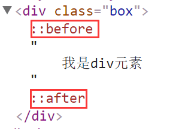

[TOC]
# 第三天
## CSS选择器
语法：css选择器{css属性名:css属性值;}

> css属性名和css属性值中间用**冒号":"**隔开，用**分号";"**结束
#### 1标签选择器 div{ ... }
语法：标签选择器{css属性名:css属性值;}
权重：1
#### 2类选择器 .header{ ... }
语法：类选择器{css属性名:css属性值;}
权重:10
> 注意一个元素可以设置多个类名,每个类名用**空格**隔开

#### 3 id选择器 #id { ... }
权重:100;
> id选择器在页面中具有唯一性，id名不能重名(重复)


#### 4 通配符选择器 * { ... }
匹配所有HTML元素
语法:*{css属性名:css属性值;}
权重:0<*<1
> 项目中一般不用通配符选择器来选择HTML元素,比较消耗性能.

#### 5子集选择器  .div1>ul{ ... }
HTML元素存在包含关系，通过父级来确定子级
语法：父级选择器>子级选择器{css样式}
权重： 所有组合选择器之和
> **子级选择器必须是紧邻的父子关系(不能跨辈)**

#### 6后代选择器 .header li { ... }
通过根元素(祖辈)来查找后代元素
语法:祖辈选择器  后代选择器{css}样式
权重:所有选择器之和
作用：增加元素的权重，精确查找的范围

#### 7分组选择器 html,body { ... }
作用:把同一份css样式,分别给了不同HTML元素
权重:独立计算,不会叠加;
> 分组选择器之间用**逗号(",")**隔开

#### 8标签属性选择器  div[title='nav'] { ... }
利用利用签属性当选择器来用
权重:10;

#### 9 交集选择器
两种选择器同属一个元素的时候,我们可以用交集获取这个元素.
权重:所有选择器之和.
> 交集选择器由哪些选择器组合成的：**标签选择器和类选择器---最常用**(标签选择器要放在类选择器前面)、**标签选择器和标签属性选择器**、标签选择器和ID选择器、类选择器和类选择器、类选择器和标签属性选择器
```css
    div.div1{}/*11 交集选择器*/
    div[title]{} /*交集选择器*/
    div[title=zf]{}/*交集选择器*/
```
#### 10 伪类选择器 .header:hover { ... }
给HTML元素添加某种状态,项目中最常用是:hover鼠标经过
列如:鼠标经过,鼠标点击....
权重是10;
**给元素添加hover:手型 cursor: pointer;**
```html
<style>
    a{
        text-decoration: none;
    }
    /*a:link 默认的状态*/
    a:link{
        color: blue;
    }
    /*a:hover 鼠标经过时的状态  ----最常用 */
    a:hover{
        color: red;
        font-weight: bold;/*加粗*/
    }
    /*a:active 鼠标点击时的状态*/
    a:active{
        color: green;
    }
    /*a:visited  鼠标点击后的状态*/
    a:visited{
        color: #11a59f;
    }
</style>
<a href="##">超链接</a>
```

#### 11 伪元素 
用css样式给指定的元素内添加假的(不存在)内容.
> :before 在指定元素所有内容之前
> :after 在指定元素所有内容之后
使用时保证两个前提:
1. 必须有display:block;这个css属性 只支持块级元素
 2. 必须带有content="xxx";这个css属性，content的内容可以为空，例如：content="";

项目中经常使用为元素的**after**
```html
<style>
   .div1{
        color: red;
   }
   .div1:before{
       display: block;/*块*/
       content: "我是哥哥";   
   }
   .div1:after{
       display: block;
       content: "";  
   }
</style>
<div class="div1">
    我是div元素
    <br>
    我是div1元素
</div>
```

## css样式哪些元素那些属性能能继承 ?
### 文本类的可继承的属性
color,cursor,text-align,line-height,    
font相关属性(family, size, style,variant, weight)   
list-style相关(image,position,type,)  

### 列表相关属性可继承
color,cursor,text-align,  
font相关属性(family, size, style,weight)   
list-style相关(image,position,type,)  

 ### 不能继承的属性
盒模型相关(margin、border、padding、height、width,min-(width/height),max-(width/height) )    
定位相关(position、left、right、top、bottom)  
display、background、overflow、float、clear、vertical-align、   
### 所有元素可继承：visibility 和 cursor

### 终端块状元素可继承：和text-align
### 注意
* a标签不支持继承样式属性
[详见](http://www.zhufengpeixun.cn/qianduanjishuziliao/qianduanCSSziliao/2016-07-24/530.html)


## 路径
### 相对路径
是指在同一个文件夹下，找到参照物用来找到其他文件
../ 返回上一级  
./  代表平级

### 绝对路径
是指带域名文件的完整路径和磁盘中文件的完成路径
``
