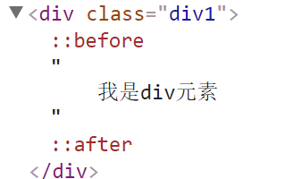
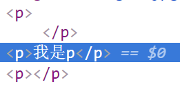

[TOC]

# 第四天
## CSS选择器
### 通配符选择器
匹配所有的HTML元素
语法：*{css属性名:css属性值;}
权重：0 < * < 1
> 在工作中，一般不用通配符选择器，因为通配符选择器匹配所有的HTML元素，比较消耗性能
```html
<style>
   *{margin:0;padding:0;} 
</style>**清除所有标签的默认边距**
<h1>h1元素</h1>
```

### 标签属性选择器
利用标签属性名和标签属性值来当做选择器来用
语法：[标签属性名]{css样式}
            [标签属性名=标签属性值]{css样式}
权重：10
> 当标签属性是class的时候，我们一般不使用标签属性选择器来选择HTML元素，而是用**类选择器**来选择HTML元素
```html
<style>
	div{}  标签权重1
    .div1{} 类选择器权重10
    以下都是标签属性选择器权重10
    [title]{}
    [title=zf]{}
    [class]{}
    [class=div1]{}
</style>
<div class="div1" title="zf">div元素</div>
```
### 交集选择器
两种选择器同属一个元素的时候，我们可以使用交集选择器来选择HTML元素
权重：所有组合选择器之和
> 交集选择器组合时，中间没有任何符号
> 交集选择器一般组成选择器有：**标签和类选择器--常用**(标签选择器要放在类选择器前面)、**标签和标签属性选择器**、**类选择器和类选择器**、标签选择器和id选择器
```html
<style>
    div{} 
    .div1{} 
    #div2{} 
    [title]{} 
    [title=zf]{} 
    [class]{} 
    [class=div1]{}
    [id]{}
    [id=div2]{}
    div.div1{}/*11 交集选择器*/
    div[title]{} /*交集选择器*/
    div[title=zf]{}/*交集选择器*/
</style>
<div class="div1" title="zf" id="div2"></div>
```
### 子级选择器
HTML元素存在包含关系，通过父级来确定子级
语法：父级选择器>子级选择器{}
权重：所有组合选择器之和
> 子级选择器必须是紧邻的父子关系(不能跨辈)
```html
<style>
	.div1 li{}
	.div1>ul>li{}
</style>
<div class="div1">
    <ul>
        <li>我是无序列表</li>
    </ul>
</div>
<div class="div2">
    <ol>
        <li>我是有序列表</li>
    </ol>
</div>
```
### 伪类选择器
给HTML元素添加某种状态
例如：点击、鼠标经过...
> 在工作中常用的伪类选择器是**:hover 鼠标经过的状态**
> div,p等也都支持伪类选择器
```html
/*a:link 默认状态*/
a:link{
	color: blue;
}
/*a:hover 鼠标经过时的状态*/
a:hover{
	color: red;
}
/*a:active 鼠标点击时的状态*/
a:active{
	color: yellow;
}
/*a:visited 鼠标点击后的状态*/
a:visited{
	color: green;
}
<a href="">a超链接</a>
```
### 伪元素
用CSS代码向指定的元素内添加假的(html中不存在)的内容
:before 在指定的元素所有的内容之前
:after 在指定元素所有内容之后
> 用伪元素必须保证两个前提：
> 1. 必须有display:block;这个css属性 只支持块级元素
> 2. 必须带有content="xxx";这个css属性，content的内容可以为空，例如：content="";


> 一般在工作中常用的伪元素**:after**，一般用来清除浮动带来的影响

```html
<style>
   .div1{
        color: red;
   }
   .div1:before{
       display: block;/*块*/
       content: "我是哥哥";   
   }
   .div1:after{
       display: block;
       content: "";  
   }
</style>
<div class="div1">
    我是div元素
    <br>
    我是div1元素
</div>
```
## 路径
### 相对路径
是指在同一个文件夹下，找到参照物用来找到其他文件
返回上一级  ../
./  代表平级
同级或平级之间直接写文件名
下一级   /
> 一般常用在**网站的图片上**、**CSS样式表**、**网站的导航**等等......

### 绝对路径
是指带域名文件的完整路径和磁盘中文件的完成路径
``
`http://www.zhufengpeixun.cn/img/0.jpg`
> 一般常在**网站的尾部**、**友情链接**上使用


## HTML常用元素的分类以及特点
### 块级元素
#### 块级元素有哪些？
|元素|描述|
|--|--|
|div|区分大模块|
|h1-h6|标题|
|p|段落|
|ul|无序列表|
|ol|有序列表|
|li|列表项|
|dl|自定义列表|
|dt|标题|
|dd|描述|
|table|标题|
|tr|行|
|td|列|

#### 块级元素的特点？
- 独占一行(从上到下排列)
- 可以设置CSS盒子模型的属性(width/height/margin/padding/border)
- 在不设置宽高时，宽是继承父级的宽度，高是由本身内容决定的
- 可以嵌套其他元素
	- dt,dd一般不做嵌套(最多嵌套a标签)
	- p元素不能嵌套块级元素(p元素也不能嵌套p元素)
		- 

### 行内元素
##### 行内元素都有哪些？
|元素|描述|
|--|--|
|span|区分行内小模块|
|strong|加粗，强调作用|
|b|加粗|
|em|斜体，强调作用|
|i|斜体|
|a|超链接、锚点|
|sup|上标|
|sub|下标|
|label|用来描述表单功能的|
##### 行内元素的特点
- 在一行显示(从左到右排布)
- 设置css属性width/height无效,根据内容实际宽高自动设置;
- 不可以嵌套块级元素
- 在编辑代码时，元素与元素之间如果敲回车或者空格时，元素与元素之间会出现间隙
	- 解决办法：给父级元素或者body设置css属性-**font-size:0;**
- 基线对齐问题

#### 行内块级元素
##### 行内块级元素有哪些
|元素|描述|
|--|--|
|img|图片|
|input|用来做表单功能的|
|textarea|文本域|

##### 行内块级元素的特点
- 在一行显示(从左到右排布)
- 可以设置css属性width/height
- 不可以嵌套块级元素
- 在不设置宽高时，宽高是由内容决定的
- 在编辑代码时，元素与元素之间如果敲回车或者空格时，元素与元素之间会出现间隙
	- 解决办法：给父级元素或者body设置css属性-**font-size:0;**
- 基线对齐问题

### 块级元素和行内、行内块级元素的相互转换
#### display
##### block 块级元素
##### inline 行内元素
##### inline-block 行内块级元素
##### none 消失、隐藏


