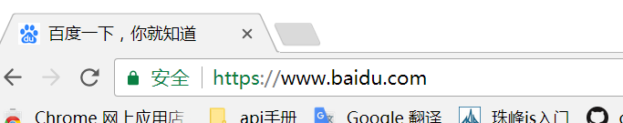

# 第六天
## 作业问题:类明命名规则,注意用背景图
- 不能是数字，不能以数字开头
- 可以写全拼  weibu
- 遵循行业规范：header 头部  nav  导航 footer尾部
- 是由两个单词组成，例如：car-icon   caricon  car_icon   carIcon
## link
- `<link rel="icon" href="img/favicon.ico" type="image/x-icon">`引入图标(页面标题的前面--页卡)
百度例子引入
- 
	- 图标的大小：64*64
	- 由UI设计师生成
- `<link rel="stylesheet" href="" type="text/css">`引入样式表
## 块级元素与行内块级元素的相互转换
### display
- inline-block 行内块
	- 基线对齐
	- 间隙
- inline 行内
	- 基线对齐
	- 间隙
### 浮动 float
- left 左浮动从左向右排
- right 又浮动从右向左排

### 浮动 float 特点
特点
- 1 不设宽高时宽高由本身内容决定的
- 2 没有基线对其和间隙问题
- 3 图文混编(图片和文字相结合,给图片设置浮动,文字会在图片周围环绕)
- 4 脱离文档流(父集元素找不到子集援素)
