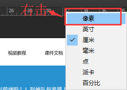
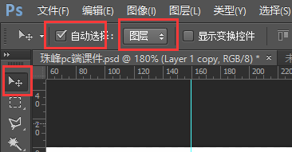
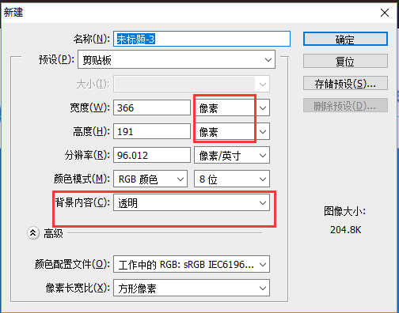
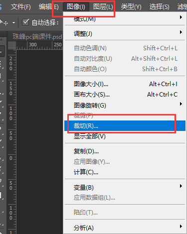
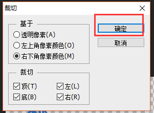
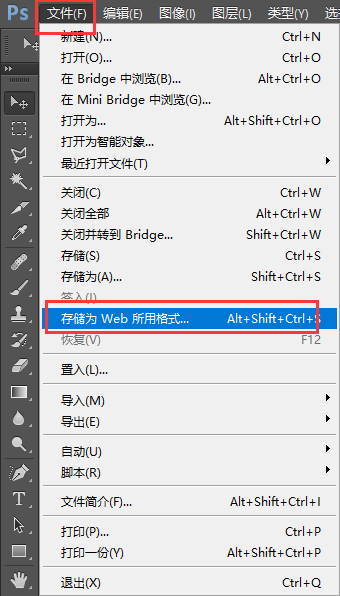

#第六天
##PS工具
- Ctrl+R  标尺
	- 
- Alt+Delete 填充图层颜色

**切图保存步骤**
- 
- 新建文件 Ctrl+N(单位：像素)   
	- 
- 图片图层拖动到新建的文件中
- 图像-->裁切
	- 
	- 
- 保存图片
	- 
	- 快捷键 Alt+Shift+Ctrl+S   保存图片

##link
- `<link rel="icon" href="img/favicon.ico" type="image/x-icon">`引入图标(页面标题的前面--页卡)
	- 图标的大小：64*64
	- 由UI设计师生成
- `<link rel="stylesheet" href="" type="text/css">`引入样式表
	

##块级元素与行内块级元素的相互转换
###display
- inline-block 行内块
	- 基线对齐
	- 间隙
- inline 行内
	- 基线对齐
	- 间隙

###float 浮动
- left 左浮动  从左向右排布
- right 右浮动 从右向左排布

##float 浮动
**特点**
- 脱离文档流(父级元素找不到子级元素)
- 不设置宽高时，宽高是由本身内容决定的
- 没有基线对齐以及间隙的问题
- 图文混编(图片和文字相结合，给图片设置浮动，文字就会在图片的周围环绕)

