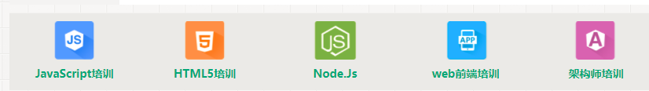

# 2018-3-2 第5天内容

选项卡效果图

## 常见git命令
* git init   
* git status //查看当前目录status状态
* git add . //添加当前目录所有文件和文件夹到git
* git commit -m "xxxx" //为当前内容添加版本注释
* git push -u origin master //将当前内容推送到远端服务器
* 
## 常见终端命令
* clear 清除命令
* ls 列出当前目录树

# 浏览器快捷键
* Ctrl+t 新建标签页面
* Ctrl+w 关闭当前标签页面
* Ctrl+shift+t 恢复刚关闭的标签页
* Ctrl+H   打开网页历史记录
* ctrl+L   将光标定位于地址栏

