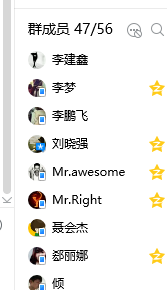

#大标题
##小标题
###小小标题
####小小小标题
#####小小小小标题
######小小小小小标题

[TOC]

[TOC]目录

加粗
**字体加粗**  快捷键 shift+"*" 或 Ctrl+B  ----常用
__字体加粗__ 快捷键 shift+"-"

斜体
*字体斜体*  
_字体斜体_

列表  快捷键：减号+空格
- 列表一
	- 子列表 按TAB键
- 列表二
- 列表三
	- 子列表1
	- 子列表2
- 列表四 shift+tab键(从子列表返回上一级列表)

注释、摘要
> 内容 快捷键：大于号+空格
> 注释内容写完后，要进行写下一项的内容，需要敲两次回车

表格 快捷键：shift+"|"
|第一排|第二排|
|--|--|
|xxx|xxx|
|丫丫|丫丫|

插入图片
- 快捷键：Ctrl+G 
	- 
- QQ截图
	- 

插入超链接
- 快捷键：Ctrl+L
	- [珠峰培训网址](http://www.zhufengpeixun.cn)
- 手动输入
	- [百度网址](http://www.baidu.com)

markdown的导出方式？
- .md格式 ，如果想要**修改、查看**笔记内容，需要用记事本方式打开，全选(Ctrl+A)-->再复制(Ctrl+C)，打开markdown软件，新建文档，再把复制的内容粘贴(Ctrl+V)到这个文档中
- .html格式，如果想要查看内容，用浏览器打开进行查看。如果想要修改内容，用编辑器(webstorm、dw)进行修改
- .pdf格式，如果想要查看内容，用wps软件进行打开。如果想要修改内容，.pdf格式的是无法进行修改里面的内容的

