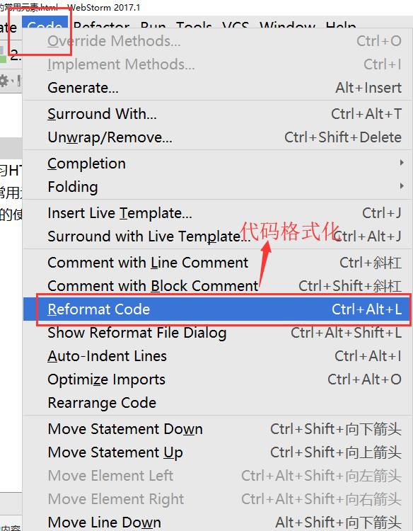

[TOC]

#第一天
##前端三层
- HTML 结构
- CSS  样式
- JavaScript(JS) 交互、动态效果
> 举例：生活中 HTML结构相当于盖房子(打地基)、CSS样式相当于装修房子、JS实现动态效果相当于打开空调的开关

##小概念的普及
###网页
网页是网站的基本要求，通俗来讲是一个HTML文件

###网站
由多个网页(页面)组成的

###站群(流水线统一化管理)
由多个网站组成的，为同一个公司服务的
例如：百度旗下的网站：百度金融、百度外卖、百度音乐......

###浏览器
是为了让用户浏览页面或者浏览HTML文件
> 谷歌浏览器最好用的
> 火狐浏览器
> IE浏览器

##网页的基本组成
- HTML 结构(网页的骨架，支撑起肉)
- CSS 样式(在网页结构的基础之上进行装修、装点)
- JS 交互、动态效果

###HTML(超文本标记语言)
网页文件本身是一个文本文件(除了文字，没有其他)，通过特定的标记描述，才能在页面中正常的显示出来。如果遇到音视频、图片，需要用**超文本(标签)**进行引入，才能正常的显示在页面中
> 例如：img 图片

```
<span style="color:#ff0000;"><span style="font-size:26px;">珠峰培训</span></span><br />
<table style="width:444px;">
	<tbody>
		<tr>
			<td style="width:148px;">
				1</td>
			<td style="width:148px;">
				1</td>
			<td style="width:148px;">
				1</td>
		</tr>
		<tr>
			<td style="width:148px;">
				1</td>
			<td style="width:148px;">
				1</td>
			<td style="width:148px;">
				1</td>
		</tr>
	</tbody>
</table>

```
###HTML的特点
浏览器是**从上到下**解析页面的，如果遇到错误，浏览器**不会报错，也不会被指出**，开发人员看页面效果来分析是哪里出错了---HTML不会报错

###HTML的兼容问题
由于浏览器是不同厂商生产的，浏览器解析页面时会出现分歧，显示的效果不一致，导致HTML的兼容问题

###超文本(标签)
####标签的语法
由成对的尖括号和关键字组成
关键字：已经规范好的，不能随便瞎起
```
<div>div</div>
 图片
<周星驰>  错误的
```

####标签属性
提供了HTML标签中的更多信息
语法：由**标签属性名**和**标签属性值**组成的
> 一个标签中，可以有多个标签属性，每个标签属性之间用**空格**隔开
> 标签名(关键字)的后面都是标签属性
```
<div title="zf" class="div1">珠峰培训</div>
div 标签
title="zf" class="div1" 标签属性
title class 标签属性名
"zf" "div1" 标签属性值
```

####标签的分类
- 开始标签 `<div>`
- 结束标签 `</div>`
- 空标签`<br/>`

####HTML元素以及分类
- **开始标签**和**结束标签**加**内容**组成的
- 空标签是为了给元素添加功能的
```
<div>内容</div> ---div元素
  img元素
```

####HTML常用元素有哪些？
- h1-h6 标题
- ul 无序列表
	- li 列表项，默认前面有一个实心小黑点
- ol 有序列表
	- li列表项，默认前面有一各序号
- dl 自定义列表
	- dt 标题，只能出现一次
	- dd 描述，可以出现多次
	- 常用在**新闻摘要**、**网站的尾部**的结构上
- div 区分大模块
- span 区分行内小模块
- img 插入图片
	- src="" 图片地址或者图片名字
	- alt="" 用来描述图片的，当图片地址不存在(错误)时，alt的标签属性值才会显示出来
- p 段落
- a 超链接、锚点
	- href="" 网址、地址
	- target="_blank" 在新的窗口打开，当前的窗口还在
	- 防止a超链接跳转：空、占位
		- 1.`<a href="##"></a>`
		- 2.`<a href="javascript:;"></a>`
		- 3.`<a href="javascript:void(0);"></a>`


```
<!--防止a超链接跳转：空、占位-->
<a href="##">珠峰培训</a>
<a href="javascript:;">耿大大</a>
<a href="javascript:void (0);">珠峰九岁了</a>
```
##快捷键
```
webstorm的快捷键
    Ctrl+C 复制
    Ctrl+V 粘贴
    Ctrl+X 剪切
    Ctrl+Z 撤退
    Ctrl+G 行数
    Ctrl+F 查找
    Ctrl+Alt+L  代码格式化
    
注释：开发人员可以看到，用户是看不到的
快捷键：
    单行注释：Ctrl+/
    多行注释：Ctrl+Shift+/(需要全部选中要注释的内容，然后再按注释的快捷键)
怎么去掉注释：你是怎么用快捷键加的注释，再来一次注释的快捷键就好 
```



