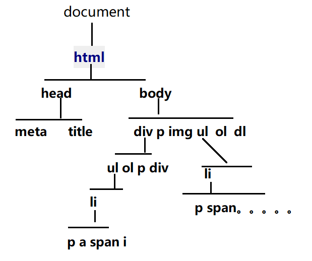

[TOC]
# 第二天
## HTML常用元素有哪些？
- strong 加粗，强调作用
- b 加粗
- em  斜体，强调作用
- i 斜体
- table 表格
	- caption 标题
	- thead 表头(标题单元格)
		- tr 行
			- th 列
	- tbody 表身(普通单元格)
		- tr 行
			- td 列
	- tfoot 表尾(普通单元格)
		- tr 行
			- td 列
- sup 上标
- sub 下标
> 在项目中常用的是下面这种格式
```html
<table><!--表格-->
	<tr><!--行-->
		<td>列</td>
	</tr>
</table>
<!--在工作中最常用的表格-->
```
```html
<table border="1">
    <thead>
        <tr>
            <th>学员姓名</th>
            <th>性别</th>
            <th>年龄</th>
            <th>民族</th>
            <th>联系方式</th>
            <th>籍贯</th>
        </tr>
    </thead>
    <tbody>
        <tr>
            <td>王消通</td>
            <td>男</td>
            <td>23岁</td>
            <td>汉族</td>
            <td>xxxxxxx</td>
            <td>山西</td>
        </tr>
        <tr>
            <td>杨杨</td>
            <td>女</td>
            <td>18岁</td>
            <td>汉族</td>
            <td>xxxxx</td>
            <td>河南</td>
        </tr>
    </tbody>
</table>
```
```html
<!--这种是项目最不常用的-->
<table border="1">
    <caption>标题</caption>
    <thead><!--表头-->
        <tr><!--行-->
            <th><!--列-->
                表头单元格
            </th>
            <th>
                表头单元格
            </th>
        </tr>
    </thead>
    <tbody><!--表身-->
        <tr>
            <td>普通单元格</td>
            <td>普通单元格</td>
        </tr>
        <tr>
            <td>普通单元格</td>
            <td>普通单元格</td>
        </tr>
    </tbody>
    <tfoot><!--表尾-->
        <tr><!--行-->
            <td><!--列-->
                表尾单元格
            </td>
            <td><!--列-->
                表尾单元格
            </td>
        </tr>
    </tfoot>
</table>
```

> a超链接、锚点如果用于锚点必须配合id来完成
> id标签属性在页面中具有唯一性，标签属性值不能重复(同名)
```html
<h3 id="top">任务经历</h3>
<sup><a href="#top">[29]</a></sup>
```
**表单类**
## form 表示了文档的区域,这个区域包含交互控制元件用来向服务器提交信息

* action 属性是表单要提交目标的URL地址
* method 是表单提交的方法

> label 主要用来提升用户体验的,用户点击label时浏览器会自动将光标定位到label的for属性对应的控件.
> label 的for属性要和其相关的inupt控件ID属性一一对应'


> 常用在登录、注册、调查问卷上
- label
- input 
	- type="text" 文本框
	- type="password" 密码框
	- type="button" 提交按钮
		- value="" 值
	- type="radio" 单选按钮
	- type="checkbox" 多选按钮
- textarea 文本域
	- maxlength 最大的长度 **常用**
	- minlength  最小的长度
- select 下拉框
	- option 值(内容)
```html
 <!--表单类-->
<label>用来描述表单功能的</label>
<input type="text"> 文本框
<input type="password"> 密码框
<input type="button" value="登录"> 提交按钮 
<input type="radio"> 单选按钮
<input type="checkbox"> 多选按钮
<textarea maxlength= "5" minlength="5">文本域</textarea>
<select><!--下拉框-->
    <option value="">北京</option>
    <option value="">上海</option>value值是用来获取的
</select>
```


## 标签语义化
合理的标签做合理的事情
> span ,div是无意义标签尽量少用
[什么叫标签语义化](http://www.zhufengpeixun.cn/qianduanjishuziliao/qianduanCSSziliao/2016-06-30/464.html)

## html的基本结构
一个HTML文件就是一个网页(页面)，又被称作是一个文档(document)
> 一个HTML文档(document)，也被称为**根元素**



### 文档声明
- `<!DOCTYPE html>` 文档的声明 作用 告诉浏览器我是什么类型,浏览器根据他的规则去解析这个文档
> 以后项目中可以直接写HTML5文档声明,高版本兼容低版本
> 声明必须写在第一行,否则可能出现诡异现象
> 文档声明不是html标签,是一条声明语句
 
### html 元素
### head 元素 页面头部
#### meta元素
- charset=""  编码格式
	- UTF-8  ---**常用**
	- gb2312
- name="keywords" content="关键字"
- name="description"  content="描述网站的一句话"
	- 为了网站SEO优化、引擎搜索
#### title 标题
 > 页面的标题出现在页卡位置,一个页面只有一个标题

### body 元素
 > body是页面的主体部分,所有让用户浏览内容都写在这个页面里,即所有的标签.


## CSS层叠样式表
  作用: 给HTML元素添加动态或静态样式
### 4种融合方式
  * 1行内式 style直接写在标签里
  * 2内嵌式 style写在head里
  * 3外链式：将css代码单独放在css文件中，再通过link标签进行引入
> link标签一般放在head元素内(title标题后面)
> 
> 在项目中，经常使用的css引入方式是**外链式**
```html
<link rel="stylesheet" href="style.css" type="text/css">
link 标签
rel="stylesheet" 不可缺少，样式表
href="" css样式表的路径、地址
type="text/css"  类型，可以省略，但是建议写全
```
* 4导入式通过impute导入

#### 外链式link和导入式imput的相同点与区别
* 1相同点都是引入外部的css文件
* 2不同点link是html标签，@import完全是css提供的 方式，要写在css文件或者style标签中。
* 3加载顺序也是有区别的，当一个页面被加载的时候，link引用的css文件会被同时加载，而@import引入的css文件会等页面全部下载完后再加载。
* 4当使用javascript控制DOM去改变css样式的时候，只能使用link标签，因为import是不能被DOM控制的。

#### CSS选择器
语法：css选择器{css属性名:css属性值;}

> 每一个css属性名和css属性值中间用**冒号":"**隔开，用**分号";"**结束
##### 1标签选择器
直接用标签名当做选择器来用
语法：标签选择器{css属性名:css属性值;}
权重：1
```css
<style>
	div{color:red;}
	<!--标签选择器,匹配了body元素中的所有的div元素，并给这个元素添加了css样式-->
</style>
<div>div1</div>
<div>div2</div>
```
##### 2类选择器
在标签名的后面，加了标签属性class，利用标签属性值来获取html元素，必须在标签属性值前面加一个"."
语法：类选择器{css属性名:css属性值;}
权重:10
```html
<style>
    .div2 {
        color: yellow;
    }
    div {
       color: red;
    }
</style>
<div>div元素</div>
<div class="div2">div1元素</div>
```

