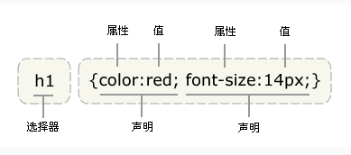
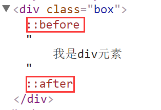

[TOC]

#第三天
##CSS选择器
语法：css选择器{css属性名:css属性值;}

```
div{color:red;}
```
###CSS选择器分类
####标签选择器
直接用标签名(关键字)当做选择器来用
语法：标签选择器{css属性名:css属性值;}
权重：1
```
<style>
	div{color:red;}
</style>
<div>div1</div>
<div>div2</div>
```
####类选择器
在标签名后面，加了一个标签属性class，利用**标签属性值(类名)**当做选择器来用，必须前面加一个"."
语法：类选择器{css属性名:css属性值;}
权重：10

> 类名(标签属性值)可以重复使用
>  
>  一个元素中，class的类名(标签属性值)可以有多个，每个类名之间用**空格**隔开
```
<style>
    div {
        color: red;
    }
    .div2{
        color: blue;
    }
    .div3{
        font-size: 40px;
    }
</style>
<div>div1</div>
<div class="div2">div2</div>
<p class="div2 div3 div4">p元素</p>
```
####id选择器
在标签名后面，加了一个标签属性id，利用**标签属性值(id名)**当做选择器来用，必须前面加一个"#"
语法：id选择器{css属性名:css属性值;}
权重：100
> id选择器在页面中具有唯一性，id名不能重名(重复)
>  
>  id选择器是配合JS交互、动态效果来完成的
```
<style>
	.div1{color:red;}
	/**类选择器 权重：10**/
	
	#div2{color:green;}
	/**id选择器 权重：100**/
</style>
<div class="div1" id="div2"></div>
<div id="div1"></div>
```
标签选择器相当于人的姓，类选择器相当于人的姓名，id选择器相当于人的身份证号

####通配符选择器
匹配所有HTML元素
语法：*{css属性名:css属性值;}
权重：0 < * < 1
> 在项目中，一般不用通配符选择器来选择HTML元素，通配符选择器比较消耗性能
```
<style>
	*{margin:0;padding:0;}
	/**清除所有标签的默认边距**/
</style>
<h1>h1元素</h1>
<p>p元素</p>
```
####子级选择器
通过父级来找到子级元素
语法：父级选择器>子级选择器{css样式}
权重：所有组合选择器之和
> 子级选择器，必须是父子紧邻的关系
```
<style>
	.div1>ul>li>a{   /*权重：13*/
        color: red;
    }
    .div1>a{}/**错误的，不能跨辈**/
</style>
<div class="div1">
    <ul>
        <li>
            <a href="">1111111</a>
        </li>
    </ul>
</div>
<div class="div2">
    <ul>
        <li>
            <a href="">222222</a>
        </li>
    </ul>
</div>
```
####后代选择器
通过祖辈选择器来查找后代元素
语法：祖辈选择器 后代选择器{css样式}
权重：所有组合选择器之和
> 作用：增加元素的权重，精确查找的范围
```
<style>
    .div1>ul>li>a{/*子级选择器 权重：13*/}
    .div1 a{/*后代选择器 权重：11*/
        color: deeppink;
    }
    .div1 li a{}/*后代选择器 权重：12*/
</style>
<div class="div1">
    <ul>
        <li>
            <a href="">1111111</a>
        </li>
    </ul>
</div>
<div class="div2">
    <ul>
        <li>
            <a href="">222222</a>
        </li>
    </ul>
</div>

```
####分组选择器
作用：把同一份css样式，分别给了不同的HTML元素
语法：选择器1,选择器2,选择器3{css属性名:css属性值;}
权重：分组选择器是独立计算的，不会叠加
> css样式(大括号)的前面没有任何的符号
```
<style>
	.div2,p,h1{color:red;}
</style>
<div>div1元素</div>
<div class="div2">div2元素</div>
<p>p元素</p>
<h1>h1元素</h1>
```
####标签属性选择器
利用标签属性当做选择器来用
语法：[标签属性名]{css属性名:css属性值;}
           [标签属性名=标签属性值]{css样式}
权重：10
> 在元素中，如果有class类名，那么我们直接使用类选择器来获取HTML元素，不能标签属性选择器来获取
```
<style>
    div{} /**标签选择器 权重：1**/
    .div1{}/**类选择器 权重：10**/
    [title]{}/**标签属性选择器 权重：10**/
    [title=zf]{}
    [class]{}
    [class=div1]{}
</style>
<div class="div1" title="zf">div元素</div>
```
####交集选择器
两种选择器同属一个元素的时候，那么我们可以利用交集选择器来获取HTML元素
权重：所有组合选择器之和
> 交集选择器由哪些选择器组合成的：**标签选择器和类选择器---最常用**(标签选择器要放在类选择器前面)、**标签选择器和标签属性选择器**、标签选择器和ID选择器、类选择器和类选择器、类选择器和标签属性选择器
```
<style>
    /*div{}
    .div1{}
    [title]{}
    [title=zf]{}
    [class]{}
    [class=div1]{}
    #div2{}*/
    /*div.div1{!*交集选择器  权重：11*!
        color: red;
    }*/
    /*div#div2{}*/
    div[title=zf]{
        color: blueviolet;
    }
</style>
<div class="div1" title="zf" id="div2">div元素</div>
```
####伪类选择器
给HTML元素添加某种状态
例如：鼠标经过时、鼠标点击时....
权重：10
> 在项目中，常用的伪类选择器是**:hover**鼠标经过时的状态
```
<style>
    a{
        text-decoration: none;
    }
    /*a:link 默认的状态*/
    a:link{
        color: blue;
    }
    /*a:hover 鼠标经过时的状态  ----最常用 */
    a:hover{
        color: red;
        font-weight: bold;/*加粗*/
    }
    /*a:active 鼠标点击时的状态*/
    a:active{
        color: green;
    }
    /*a:visited  鼠标点击后的状态*/
    a:visited{
        color: #11a59f;
    }
</style>
<a href="##">超链接</a>
```
####伪元素
用css样式向指定的元素内，添加假的(HTML中不存在)的内容
权重：10
> :before 在指定元素的**所有内容**之前
> :after 在指定元素的**所有内容**之后
>  
> 在项目中，经常使用伪元素的**:after**

- 在使用伪元素时，必须保证两个前提：
	- 1) 必须带有CSS属性--**display:block;**
	- 2) 必须带有css属性--**content=""** 
		-  content的内容可以为空，但是必须有content="";


```
<style>
    .box{
        color: red;
    }
    .box:before{
        display: block;/*块*/
        content: "我是哥哥";
        color: green;
        font-size: 50px;
    }
    .box:after{
        display: block;
        content: "";
        color: pink;
        font-size: 30px;
    }
</style>
<div class="box">
    我是div元素
</div>
```
##CSS样式的继承
- 可继承的样式
	- 文本类
		- font-size
		- color
		- line-height
		- ....
	- 列表类
		- list-style:none;
		- ....
	
[关于CSS样式继承方式](http://www.zhufengpeixun.cn/qianduanjishuziliao/qianduanCSSziliao/2016-07-24/530.html)

##路径
###绝对路径
指带域名的文件的完整路径或磁盘中指定文件的全部路径
`www.zhufengpeixun.cn/img/1.jpg`
``
> 一般用在网页中的**友情链接**、**网站的尾部**
###相对路径
去找一个包含所有文件夹的参考点，再去找我们需要的文件
返回上一级  ../
平级(同级)之间直接文件夹的名字
下一级    /


         