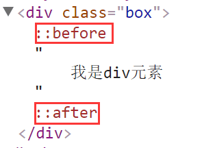

[TOC]
# 第三天
## CSS选择器
语法：css选择器{css属性名:css属性值;}

> 每一个css属性名和css属性值中间用**冒号":"**隔开，用**分号";"**结束
#### 1标签选择器
直接用标签名当做选择器来用
语法：标签选择器{css属性名:css属性值;}
权重：1
```css
<style>
	div{color:red;}
	<!--标签选择器,匹配了body元素中的所有的div元素，并给这个元素添加了css样式-->
</style>
<div>div1</div>
<div>div2</div>
```
#### 2类选择器
在标签名的后面，加了标签属性class，利用标签属性值来获取html元素，必须在标签属性值前面加一个"."
语法：类选择器{css属性名:css属性值;}
权重:10
> 注意类名可以重复使用,一次可以出现多个，每个类名用**空格**隔开
```html
<style>
    div {
        color: red;
    }
    .div2{
        color: blue;
    }

    .div3{
        font-size: 40px;
    }
</style>
<div>div1</div>
<div class="div2">div2</div>
<p class="div2 div3">p元素</p>
```

```html
<style>
    .div2 {
        color: yellow;
    }
    div {
       color: red;
    }
</style>
<div>div元素</div>
<div class="div2">div1元素</div>
```

#### 3 id选择器
语法: ID选择器{css属性名:css属性值;
权重:100;
> id选择器在页面中具有唯一性，id名不能重名(重复)
>  id选择器是配合JS交互、动态效果来完成的
```html
<style>
	.div1{color:red;}
	/**类选择器 权重：10**/
	
	#div2{color:green;}
	/**id选择器 权重：100**/
</style>
<div class="div1" id="div2"></div>
<div id="div1"></div>
```

#### 4 通配符选择器
匹配所有HTML元素
语法:*{css属性名:css属性值;}
权重:0<*<1
项目中一般不用通配符选择器来选择HTML元素,比较消耗性能.
```html
<style>
   *{margin:0;padding:0;} 
</style>**清除所有标签的默认边距**
<h1>h1元素</h1>
<p>p元素</p>
```
#### 5子集选择器
HTML元素存在包含关系，通过父级来确定子级
语法：父级选择器>子级选择器{css样式}
权重： 所有组合选择器之和
> **子级选择器必须是紧邻的父子关系(不能跨辈)**
```html
<style>
	.div1>ul>li>a{   /*权重：13*/
        color: red;
    }
    .div1>a{}/**错误的，不能跨辈**/
</style>
<div class="div1">
    <ul>
        <li>
            <a href="">1111111</a>
        </li>
    </ul>
</div>
<div class="div2">
    <ul>
        <li>
            <a href="">222222</a>
        </li>
    </ul>
</div>
```
#### 6后代选择器
通过根元素(祖辈)来查找后代元素
语法:祖辈选择器  后代选择器{css}样式
权重:所有选择器之和
作用：增加元素的权重，精确查找的范围
```html
<style>
    .div1>ul>li>a{/*子级选择器 权重：13*/}
    .div1 a{/*后代选择器 权重：11*/
        color: deeppink;
    }
    .div1 li a{}/*后代选择器 权重：12*/
</style>
<div class="div1">
    <ul>
        <li>
            <a href="">1111111</a>
        </li>
    </ul>
</div>
<div class="div2">
    <ul>
        <li>
            <a href="">222222</a>
        </li>
    </ul>
</div>
```
#### 7分组选择器
作用:把同一份css样式,分别给了不同HTML元素
语法：选择器1,选择器2,选择器3{css样式}
权重:独立计算,不会叠加;
> 分组选择器之间用**逗号(",")**隔开
> css样式的**大括号"{}"**前面没有任何的符号

#### 8标签属性选择器
利用利用签属性当选择器来用
权重:10;
```html
<style>
	div{}  标签权重1
    .div1{} 类选择器权重10
    以下都是标签属性选择器权重10
    [title]{}
    [title=zf]{}
    [class]{}
    [class=div1]{}
</style>
<div class="div1" title="zf">div元素</div>
```
#### 9 交集选择器
两种选择器同属一个元素的时候,我们可以用交集获取这个元素.
权重:所有选择器之和.

#### 10 伪类选择器
给HTML元素添加某种状态
列如:鼠标经过,鼠标点击....
权重是10;
> 项目中最常用是:hover鼠标经过
```html
<style>
    a{
        text-decoration: none;
    }
    /*a:link 默认的状态*/
    a:link{
        color: blue;
    }
    /*a:hover 鼠标经过时的状态  ----最常用 */
    a:hover{
        color: red;
        font-weight: bold;/*加粗*/
    }
    /*a:active 鼠标点击时的状态*/
    a:active{
        color: green;
    }
    /*a:visited  鼠标点击后的状态*/
    a:visited{
        color: #11a59f;
    }
</style>
<a href="##">超链接</a>
```
#### 11 伪元素
用css样式给指定的元素内,添加假的(不存在)内容.
> :before 在指定元素所有内容之前
> :after在指定元素所有内容之后
使用时保证两个前提:
1. 必须有display:block;这个css属性 只支持块级元素
 2. 必须带有content="xxx";这个css属性，content的内容可以为空，例如：content="";

项目中经常使用为元素的**after**

## CSS样式的继承
[关于CSS样式继承方式](http://www.zhufengpeixun.cn/qianduanjishuziliao/qianduanCSSziliao/2016-07-24/530.html)
- 可继承的样式
    - 文本类
> font,

## 路径
### 相对路径
是指在同一个文件夹下，找到参照物用来找到其他文件
返回上一级  ../
./  代表平级
同级或平级之间直接写文件名
下一级   /
> 一般常用在**网站的图片上**、**CSS样式表**、**网站的导航**等等......

### 绝对路径
是指带域名文件的完整路径和磁盘中文件的完成路径
``
`http://www.zhufengpeixun.cn/img/0.jpg`
> 一般常在**网站的尾部**、**友情链接**上使用


div span区别什么时候用/


@input好处 使用场合
注册列表样式书写怎么写/
添加样式要不要套东西?

