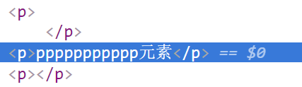
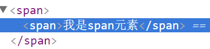
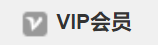

[TOC]

#第四天
##HTML元素的分类
###块级元素
####块级元素有哪些
|元素|描述|
|--|--|
|div|区分大模块|
|p|段落|
|h1-h6|标题|
|ul|无序列表|
|li|列表项|
|ol|有序列表|
|dl|自定义列表|
|dt|标题|
|dd|描述|
|table|表格|
|tr|行|
|td|列|
####块级元素的特点
- 独占一行(从上到下排列)
- 可以设置CSS盒子模型的所有属性(width/height/border/margin/padding)
- 在不设置宽高时，宽是继承父级的宽度，高是由本身内容决定的
- 可以嵌套其他元素
	- p元素不能嵌套块级元素(p元素也不能嵌套p元素)
		- 
	- dt,dd一般不嵌套块级元素(最多嵌套a，img标签)

###行内元素
####行内元素
#####行内元素有哪些？
|元素|描述|
|--|--|
|span|区分行内小模块|
|strong|加粗，强调作用|
|b|加粗|
|i|斜体|
|em|斜体，强调作用|
|a|超链接、锚点|
|label|用来描述标签功能的|
|sup|上标|
|sub|下标|
#####行内元素的特点
- 在一行显示(从左到右排布)
- 不可以设置宽高
- 在不设置宽高时，宽高是由本身内容决定的
- 不可以嵌套块级元素(可以嵌套行内元素)
	- 
- 在编辑代码时，行内元素与行内元素之间遇到空格或者换行时，会出现间隙
	- 解决方法：给body或者父级元素设置font-size:0;
- 基线对齐问题

####行内块级元素
#####行内块级元素有哪些
|元素|描述|
|--|--|
|img|图片|
|input|用来添加表单的功能的|
|select|下拉框|
|textarea|文本域|
#####行内块级元素的特点
- 在一行显示(从左到右)
- 可以设置宽高
- 在不设置宽高时，宽高是由本身内容决定的
- 不可以嵌套其他元素
- 在编辑代码时，行内元素与行内元素之间遇到空格或者换行时，会出现间隙
	- 解决方法：给body或者父级元素设置font-size:0;
- 基线对齐问题

####行内元素与行内块级元素的区别
- 行内元素不可以设置宽高
- 行内块级元素可以设置宽高

##块级元素与行内元素、行内块级元素之间的相互转换
###display
####block 块级元素  ----常用
**特点**
- 独占一行，从上到下排布
- 可以设置css盒子模型的所有属性
- 在不设置宽高时，宽是继承父级的宽度，高是由本身内容的决定的
- 可以嵌套其他元素
	- 行内元素转换成块级元素(不能嵌套块级元素)
```
<span style="display:block;">
	<div></div>
</span>
 这样元素嵌套是错误的
```

####inline 行内元素
**特点**
- 在一行显示(从左到右)
- 不可以设置宽高
- 在不设置宽高时，宽高是由本身内容决定的
- 在编辑代码时，行内元素与行内元素之间遇到空格或者换行时，会出现间隙
	- 解决方法：给body或者父级元素设置font-size:0;
- 基线对齐问题

####inline-block 行内块级元素  ----常用
**特点**
- 在一行显示(从左到右)
- 可以设置宽高
- 在不设置宽高时，宽高是由本身内容决定的
- 在编辑代码时，行内元素与行内元素之间遇到空格或者换行时，会出现间隙
	- 解决方法：给body或者父级元素设置font-size:0;
- 基线对齐问题

####none 隐藏、消失
给元素设置display:none;这个css属性，这个元素会在页面中消失(隐藏)。如果再想让这个元素显示在页面中，可以给这个元素设置display:block;，就会重新显示在页面中
```
<style>
    *{margin:0;padding:0;}
    ul{list-style: none;}
    .top{
        width:300px;
        background-color: bisque;
    }
    .top p{
        line-height: 30px;
        color: #fff;
        background-color: #ff0000;
        text-align: center;
    }
    .top ul{
        display: none;
    }
    /*.top p:hover+ul{
        display: block;
    }*/
    .top:hover ul{
        display: block;
    }

</style>
<div class="top">
    <p>我是p元素</p>
    <ul>
        <li>无序列表</li>
        <li>无序列表</li>
        <li>无序列表</li>
    </ul>
</div>
```
##vertical-align 改变行内元素以及行内块级元素的对齐方式
|值|描述|
|--|--|
|top|所有平级元素，找最高(高度最高)的顶部进行对齐|
|middle|所有平级元素，找最高(高度最高)的中部进行对齐|
|bottom|所有平级元素，找最高(高度最高)的低部进行对齐|
|px/%||
> 在项目中，经常使用的CSS属性是**vertical-align:middle;**
> 在页面结构中**背景图(雪碧图)**和**文字**相结合的时候
> 想要改变行内、行内块级元素的对齐方式时，必须给每个元素设置CSS属性---vertical-align
```
<!--在下面这个结构中经常使用vertical-align:middle;这个CSS属性-->
<span>
	<i></i>购物车
</span>
```




