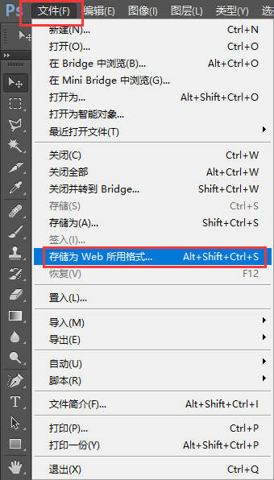

#第五天
##CSS盒子模型
HTML页面相当于一个大的仓库，每个元素都相当于一个盒子，盒子和盒子之间的距离(margin外边距)，盒子里面的货物本身有宽高(width/height)，盒子里面与货物之间有个白色泡沫(padding内边距)，盒子本身有厚度(border边框)

width 宽度
height 高度
padding 内边距
margin 外边距
border 边框

###padding 内边距
**第一种**
padding:1px 2px 3px 4px;上 右  下 左
padding:1px 2px 3px;上 左右 下
padding:1px 2px;上下 左右
padding:1px;设置了四个方向的值
**第二种**
padding-top:1px;上内边距
padding-right:1px;右内边距
padding-bottom:1px;下内边距
padding-left:1px;左内边距
> 当设置padding为一个值或者两个值的时候，可以用第二种写法
> 当设置padding为三个值或者四个值的时候，可以用第一种写法

###margin 外边距
margin:1px 2px 3px 4px;上 右  下 左
margin:1px 2p 3px;上 左右 下
margin:1px 2px;上下 左右
margin:1px;设置了四个方向的值

margin-top:1px;上外边距
margin-right:1px;右外边距
margin-bottom:1px;下外边距
margin-left:1px;左外边距

> 盒子与盒子(块元素与块元素)之间的间距可以用margin(例如：div与div，li与li)
> 设置盒子里面的边距(行内元素与行内元素)之间的间距可以用padding(例如：span与i.....)

####margin的兼容问题
- 两个平级元素，第一个元素设置margin-bottom值，第二个元素也设置margin-top值，两个元素之间的间距，不是取margin之和，而是取这两个元素的margin最大值
```
<style>
    .div1{
        width: 100px;
        height: 100px;
        background-color: red;
        margin-bottom: 10px;
    }
    .div2{
        width: 100px;
        height: 100px;
        background-color: pink;
        margin-top:50px;
    }
</style>
<div class="div1"></div>
<div class="div2"></div>
```
- 两个元素是包含关系时，父元素没有设置border-top或者padding-top时，给子元素设置margin-top值时，会出现值传递问题(把值传递给父级元素)
	- 解决方法：
		- 1.给父元素设置 `overflow: hidden;`CSS属性
		- 2.将子元素的margin-top值去掉，换成给父元素设置padding-top值就可以了---**常用**

###border边框
border:10px green solid;**常用**
border-top:1px solid red;上边框**常用**
border-right:1px solid red;右边框
border-bottom:1px solid red;下边框**常用**
border-left:1px solid red;左边框

border-width:10px; 边框的宽度
border-width:1px 2px 3px 4px;上 右  下 左
border-width:1px 2px 3px; 上 左右 下
border-width:1px 2px; 上下 左右

border-color:red; 边框的颜色
border-color:red green blue  yellow; 上 右  下 左

border-style:solid; 边框的样式
border-style:solid dashed dotted double;上 右  下 左

> border可以实现实心小三角形，border-width可以控制小三角形的大小
```
.div2{
     width:0;
     border-width: 10px;
     border-style:solid;
     border-color: transparent transparent transparent green;
}
<div class="div2"></div>
```

CSS盒子模型的计算公式：
AllWdith = width + 左右padding + 左右border
  180     =    100  +       30+30    +     10+10

AllHeight = height +上下padding +上下border
  180     =    100  +       30+30    +     10+10

##CSS属性之background背景
- background-color:red; 背景颜色
- background-image: url("背景图片路径");背景图片
- background-repeat:no-repeat;改变背景图片的平铺方式
	- 一个值
		- repeat; 平铺，默认值
		- no-repeat; 不平铺 **常用**
		- repeat-x; x轴平铺
		- repeat-y; y轴平铺
- background-position: center center;改变背景图片的位置
	- 两个值：
		- 第一个值：x轴(水平方向)
		- 第二值： y轴(垂直方向)
		- 单位：**px**、百分比、**英文单词**
			- **background-position: center center;**让背景图片在元素中的水平、垂直方向的中心点重合
			-  **background-position: 30px 40px;**
-  background-size:100% 100%;改变背景图片的大小
	-  两个值：
		- 第一个值：x轴(水平方向)
		- 第二值： y轴(垂直方向)
		- 单位：**px**、**百分比**、英文单词
		- **background-size: cover;**等比例把背景图片放大缩小
		- **background-size: 100% 100%;**元素宽高有多大，背景图片就有多大

> background是一个复合属性，所以也可以写以下这种格式：
> **background: red url("pic_02.png") no-repeat center center;**----**这种写法格式是在项目中最常用**
> background:背景颜色  背景图片的路径  背景图片是否平铺   改变背景图片的位置

> 如果使用复合属性background，想要设置背景图片的大小，只能另起一行，再设置一下background-size:100% 100%;

> **如果想要给元素添加背景图片，必须给这个元素设置宽高**
			

##PS使用
- Ctrl+"+" 放大
- Ctrl+"-" 缩小
- Ctrl+"N" 新建
- 空格键+鼠标左键    拖动图片

- .psd格式  源文件(在工作中UI设计师会给前端一个psd的设计图)
- .jpg格式   ----白色背景
- .png格式  ----透明背景
- .gif格式  动态图

- 保存图片
	- 

> 版心：.main{width:1200px;margin:0 auto;} 设置盒子在水平位置居中
