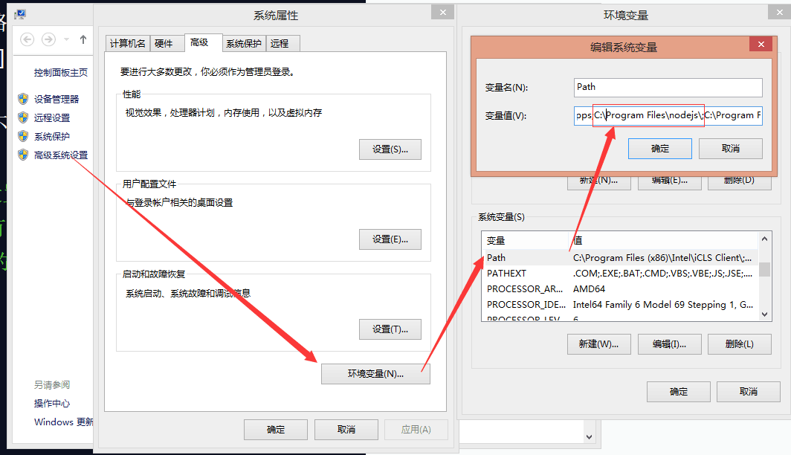
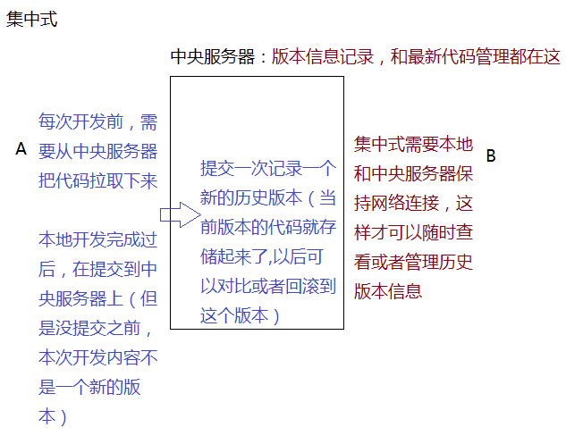
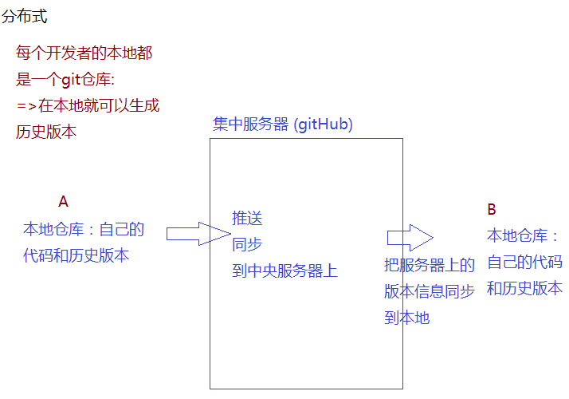

[TOC]
# 正式课 第一天
## git & node 安装
### NODE安装
https://nodejs.org/zh-cn/ 
推荐大家使用LTS稳定版本，把安装包下载下来后，直接一路下一步安装即可（最好把它安装到C盘 [默认盘符] ，记号安装目录）

1. 如果安装不了，我们可以把别人安装完成的内容拷贝过来，通过修改环境变量完成安装
> 高级系统设置 -> 环境变量 -> 系统变量 -> Path，把原有的变量值备份一份，在原有的基础上增加node的安装目录即可


2.验证安装是否成功
WIN + R  => 打开运行窗口 => 输入cmd => 打开DOS窗口
在DOS窗口中，输入 node -v / node --version / npm -v 能出现版本号，则代表安装成功，不能出现版本号，提示node不是内部或者外部命令的，遵循第一步配置环境变量即可


### NODE 基础概念
> 1. node并不是一门语言,他是一个工具或者环境
    - 基于v8引擎渲染和解析JS的
    - 单线程
    - 无阻塞I/O操作
    - 事件驱动
    - .....
之所以把node称之为服务器端语言,是因为node给予JS操作服务器端的能力:我们在服务器端安装node,只用JS完成服务器想要处理的一些事情,最后把写好的JS代码交给node环境运行即可

> 2. 在node环境中把JS代码执行
    - REPL命令 (Read-EValuate-Print-Loop)输入-求值-输出-循环
    - 基于node xxx.js 命令执行
    - 基于WEB这类编辑工具直接执行

基于NODE命令执行,我们需要找到当前文件所在文件夹,然后在这个目录下打开DOS窗口,在窗口执行node xxx.js,这样就在node环境下把JS 文件中代码执行
> 如何在当前文件目录中打开DOS窗口
> - 基于DOS命令中的的"cd"一层层进入
> - 在当前目录地址栏中输入cmd，快速在当前目录打开
> - shift+鼠标右键，在此处打开命令窗口


### 扫盲常用的DOS命令
ping www.baidu.com -t : 测试网速
Ctrl c 结束当前正在运行操作
exit : 退出当前窗口
ipconfig -all:  查看当前电脑的物理地址/IP地址/子网掩码/DNS等信息
cls : 清屏
cd : 进入到指定的文件目录(windows电脑需要先进入对应的磁盘)
cd ../ :返回上级目录
cd ./ :当前目录
cd / :根目录
ls :查看当前目录下所有文件

mkdir : 创建文件
copy con XXX.xx :创建文件并且给文件中输入内容,输入完成后,用Ctrl+c结束并保存

rm xxx.xx :删除文件
rmdir xxx 删除文件夹


### NPM 模块管理
**第一阶段:**
安装完成NODE,基本上自带npm模块管理器
需求: 我们需要一个第三方(别人写的)模块`插件`类库`或者框架等,我们需要下载安装才可以使用
- 百度搜索找到下载地址，然后基于浏览器下载即可（资源比较混乱，不好搜索）

- 也可基于npm 等第三方包管理器下载(yarn/bower...)都是第三方模块管理器

1. npm下载的资源都是在 http://www.npmjs.com/中下载的
    npm install xxx : 把资源或者第三方模块下载到当前目录下

     npm install xxx  -g (--global): 把资源或者第三方模块安装到全局环境下(目的:以后可以基于命令来操作一些事情)
     `npm uninstall xxx / npm uninstall xxx -g`：从本地或者全局卸载

     > 基于nrm安装一些细节点:
     > - 需要联网(基于npm是从国外服务器上下载资源,所以速度较慢)
     > - 下载成功后 当前目录中多增加一个node_modules文件夹在这个文件夹下找到我们的安装模块
     > - 一般来说,下载下来的内容包含源码和最后供开发者使用的压缩版本

2. 解决下载慢问题
    - 基于npm切换到国内下载资源(一般是淘宝镜像)
        首先安装nrm,而且是把它安装到全局环境下(应为我们需要使用命令)
        > npm install nrm -g
        >  
        > 安装完成后，我们可以使用 nrm 命令
        > - nrm ls 查看当前可用源
        > - nrm use xxx 使用某个源
        >  
        > 切完源，还是基于npm安装操作


    - 可以基于yarn安装管理
    首先还是需要先安装yarn，安装到全局，然后基于yarn安装我们需要的模块
    > npm install yarn -g
    >  
    > 基于yarn安装（只能安装在本地，不能安装到全局）
    > yarn add xxx
    > yarn remove xxx

    - 基于cnpm淘宝镜像来处理


3. 解决安装版本问题
 > 首先查看当前模块的历史版本信息,
 > npm view jquery >jquery.version.json :把当前模块的历史信息输出到具体的某个文件中（文件名自己随便起的）
 >
 > 安装指定的版本模块
 > `yarn add jquery@1.11.3`：npm和yarn都是这样来指定安装具体版本模块的


----

课后扩展：
1. bower是从gitHub下载安装，有兴趣同学回去研究一下它的使用
2. 回去后向全局环境中安装：less /  babel-cli ...

检查版本是否安装成功 lessc --version
检查版本是否安装成功 babel --version

## gitHub基础管理
> 一个提供代码管理(托管)的公共平台.我们以及众多开发者,会把自己生产的组件/类库/插件/框架等托管到这个平台中,供别人使用和研究.

> 在gitHub中,我们可以创建仓库来管理自己的项目文件,而GitHUb支持开发者通过git操作,把本地项目代码推送到指定的仓库中,他还提供静态web页面的发布等

> 在国内有一个和gitHub类似的网站:coding和gitHub类似,也是提供代码管理的平台
1. 基于gitHUb 创建仓库管理代码

### git 的基础知识
> git是一个分布式代码版本管理控制系统
> - 记录当前产品代码的所有版本信息(历史修改信息),而且可以方便快速回退到某一个具体的版本
> - 方便团队协作开发,能够监测代码冲突,能够合并代码等;
SVN : 再git 诞生之前就已经有的版本控制系统,不过他是"集中式"管理
git : 是分布式版本管理系统
`
1. 集中式版本控制系统



2. 分布式版本管理系统


### git 的工作原理和基本操作
**在本地创建git仓库管理我们的代码**
> 初次使用git先在本地配置一些基础信息
> \$git config -l
> \$git config --global user.name xxx
> \$git config --global user.email xxx
> 建议大家配置的用户名和邮箱和GitHub保持一致(这样以后在本地向GitHub推送内容的时候,能够展示出是谁推荐的)

1. git init  新建仓库
> 会在当前目录中创建一个空的仓库,文件目录中生成一个"git"的隐藏文件,这个文件很重要,我们本地仓库的版本信息都储存在这这里
2..gitignore
 当前目录(git仓库根目录)创建一个".gitignore"文件,这个文件中储存了当前git提交时候所忽略的文件
 > 可基于WEB创建(new->file-> .gitignore)
 > 

 不提交
```
# dependencies
node_modules

# testing
/coverage

# production
/build

# misc
.DS_Store
.env.local
.env.development.local
.env.test.local
.env.production.local

# nmp or yarn
npm-debug.log*
yarn-debug.log*
yarn-error.log*

# webStorm
.idea
```


