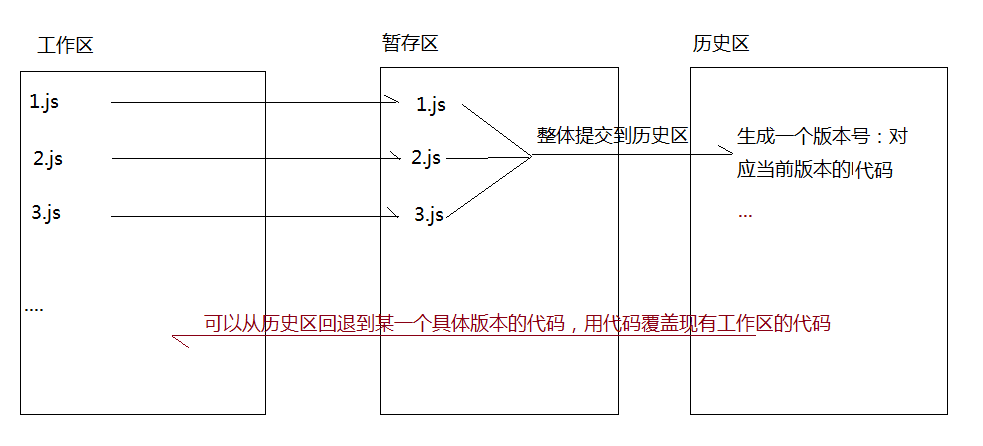

# 正式课第二天
```javascript
//=>让A和B交换数据
var a=10;
var b=20;
var c=a;
a=b;
b=c;
console.log(a,b);

//=>让E和F交换数据
var e=10;
var f=20;
e=e+f;
f=e-f;
e=e-f;
console.log(e,f);

//=>让G和H交换数据
var g=10;
var h=20;
[g,h]=[h,g];
console.log(g,h);

```
## git的工作原理及操作
当我们再本地创建一个Git仓库后,我们可以基于这个仓库管理我们的代码

**git工作流程**
> 每一个git仓库都划分为三个区
> - 工作区:编辑代码地方
> - 暂存区: 临时存放要生成版本代码地方
> - 历史区: 储存的是生成的每一个版本代码
流程如下:


**从工作区提交到暂存区**
> $ git status 
> 查看代码或者文件状态(当前处于那个区域): 红色(当前处于工作区换没提交到暂存区)绿色(当前处于暂存区换没提交到历史区),如果没有文件,代表三个区域代码已经同步,历史版本也在历史区生成了

$ git add .    /   $ git add -A 
把当前文件中所有最新文件修改文件,都提交到暂存区


**从暂存区到历史区**
$ git commit  
> 这样执行会弹出一个提交文本输入框,需要我们编写本次提交历史区,给当前版本编写备注信息
> 
> 先按i进入编辑插入模式
> 输入备注信息
> 按ESC
> 输入wq  退出

> $ git commit -m"自己要编写的备注信息"

> '$ git log 查看提交记录'

> '$ git reflog 查看所有历史记录(包括历史回滚后)'

$ git diff
> 工作区VS暂存区

$ git diff master
> 工作区VS 历史区(master分支)

$ git diff --cached
> 暂存区VS历史区