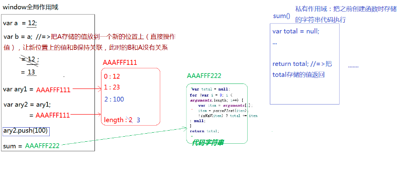
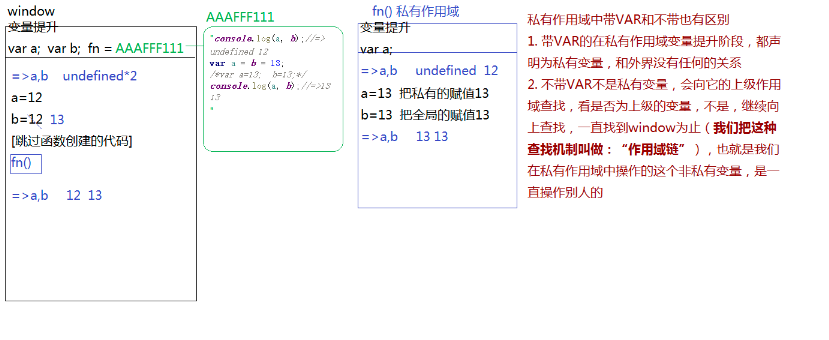

# 正式课第二天
```javascript
//=>让A和B交换数据
var a=10;
var b=20;
var c=a;
a=b;
b=c;
console.log(a,b);

//=>让E和F交换数据
var e=10;
var f=20;
e=e+f;
f=e-f;
e=e-f;
console.log(e,f);

//=>让G和H交换数据
var g=10;
var h=20;
[g,h]=[h,g];
console.log(g,h);

```
## git的工作原理及操作
当我们再本地创建一个Git仓库后,我们可以基于这个仓库管理我们的代码

**git工作流程**
> 每一个git仓库都划分为三个区
> - 工作区:编辑代码地方
> - 暂存区: 临时存放要生成版本代码地方
> - 历史区: 储存的是生成的每一个版本代码
流程如下:


**从工作区提交到暂存区**
> $ git status 
> 查看代码或者文件状态(当前处于那个区域): 红色(当前处于工作区换没提交到暂存区)绿色(当前处于暂存区换没提交到历史区),如果没有文件,代表三个区域代码已经同步,历史版本也在历史区生成了

$ git add .    /   $ git add -A 
把当前文件中所有最新文件修改文件,都提交到暂存区


**从暂存区到历史区**
$ git commit  
> 这样执行会弹出一个提交文本输入框,需要我们编写本次提交历史区,给当前版本编写备注信息
> 
> 先按i进入编辑插入模式
> 输入备注信息
> 按ESC
> 输入:wq  退出

> $ git commit -m"自己要编写的备注信息"

> '$ git log 查看提交记录'

> '$ git reflog 查看所有历史记录(包括历史回滚后)'

$ git diff
> 工作区VS暂存区

$ git diff master
> 工作区VS 历史区(master分支)

$ git diff --cached
> 暂存区VS历史区

###  git 和 gitHub 同步
1. 让本地的git仓库和远程仓库建立联系
    $ git remote -v 
    查看所有关联信息


2. 把本地代码推送到远程仓库上,或者从远程仓库上拉取最新的信息到本地仓库
> 我们本地推送和拉取的信息,既有代码也有版本信息,所以说语其说是推送和拉取,不如说是和远程仓库保持信息同步

在推送之前我们应该先拉取
$ git pull origin (这个名就是和远程仓库关联的这个名字,以自己设置为主) master 从远程仓库的master分支拉取最新信息

$ git push origin master
> 把自己本地信息推送到远程仓库的master分支下

以上是操作知识点,真实项目操作流程
1. LODER会首先创建一个远程仓库(这个仓库可能为空),也可能是包含了项目需要的
3. 在本地开发产品,需要同步时创建一个远程仓库
4. 在团队协作开发时,LEADER 会在的github


## 变量 提升机制
栈内存作用:
1. 提供一个JS代码自上而下执行的环境(代码都是在栈内存中执行)
2. 由于基本数据类型值比较简单,他们的值都是直接在栈内存中开辟一个位置,把值直接储存进去
=> 当栈内存被销毁,存储的那些基本值也都跟着销毁了

堆内存: 引用值对应的空间
1. 储存引用类性值的(对象:键值对 函数: 代码字符串)
==> 当前储存的堆内存销毁,那么这个引用值就彻底没了
==> 堆内存的释放:当堆内存没有被任何变量或者其他东西所占用,浏览器会在空闲的时候自主的进行内存回收,把所有不被占用的堆内存销毁掉(谷歌浏览器)

xxx=null 通过空对象指针null可以让原始变量(或者其他东西)谁都不指向,那么原有被占用的堆内存就没有被东西占用了,浏览器会销毁他


**变量提升**
定义:当前栈内存(作用域)形成,JS代码自上而下执行之前,浏览器会把所有带var和function 关键词的进行提前"声明"或者"定义",这种事先处理机制称之为"变量提升"

==> 声明(declare): var a (undefined默认值)(告诉当前作用域有啥)

==> 定义:(defined):a=12 (定义其实就是赋值操作)(给声明的变量赋值)
[变量提升阶段]
==> 带var 的只声明未定义
==> 带“FUNCTION”的声明和赋值都完成了

```Javascript
//=>所有的定义赋值操作都是先准备值，然后再赋值的
/*var n = m = [12, 23];
/!*
 * 1. var n;
 * 2. 准备值(AAAFFF222)
 * 3. n=AAAFFF222
 *    m=AAAFFF222
 *!/*/

/*var n=[12,23];
/!*
 * 1. 声明N
 * 2. 准备值（开辟一个堆内存，存储键值对，有一个16进制地址）
 * 3. 赋值（把16进制地址赋值给N：N=AAAFFF111）
 *!/*/
```

==>变量提升只发生在当前作用域(例如:开始加载页面的时候只对全局作用域下的进行提升,应为此时函数中存储的都是字符串而已)
==> 在全局作用下声明的函数或者是"全局变量",同理私有作用域下声明的变量是"私有变量"(带var和function的才是声明)

==> 浏览器很懒,做过的事情不会重复做第二编,也就是当代码执行时遇到创建函数这部分代码后,直接跳过即可(因为变量提升阶段就已经完成了函数的赋值操作)

私有作用域形成后也不是立即执行代码,而是先进性变量提升(变量提升钱要先形参赋值)

在ES3或者ES5语法规范中只有全局作用域和函数执行的私有作用域(栈内存)其他大括号不会形成栈内存


在全局作用域下声明一个变量,也相当于给window全局对象向设置了一个属性,变量的值就是属性值(私有作用域中声明的私有变量和window没啥关系)
in 检测某个属性是否隶属于这个对象

全局变量和window中的属性存在"映射机制"

不加var的本质是window的属性


私有作用域中带var 和不带var区别
1. 带var的在私有作用域变量提升阶段,都声明为私有变量,和外界没有任何关系
2. 不带var不是私有变量,会像他的上级作用域查找,看是否为上级的变量,不是,继续向上查找,一直找到window为止(我们把这种查找机制叫做:'作用域链') 也就是我们在私有作用域中操作的这个非私有变量,是一直操作别人的