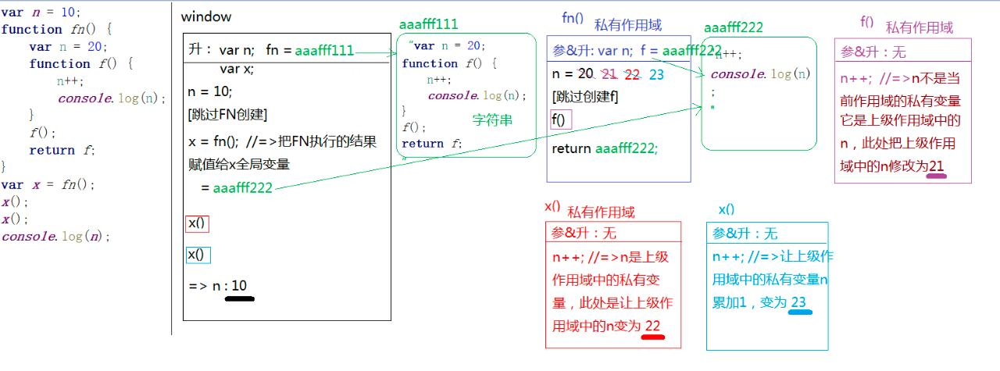
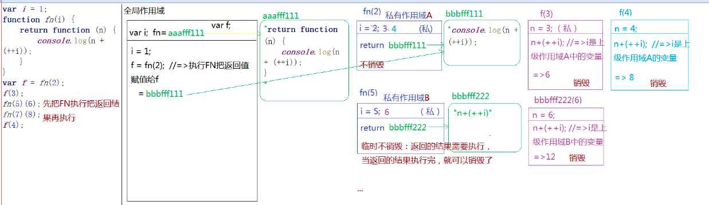
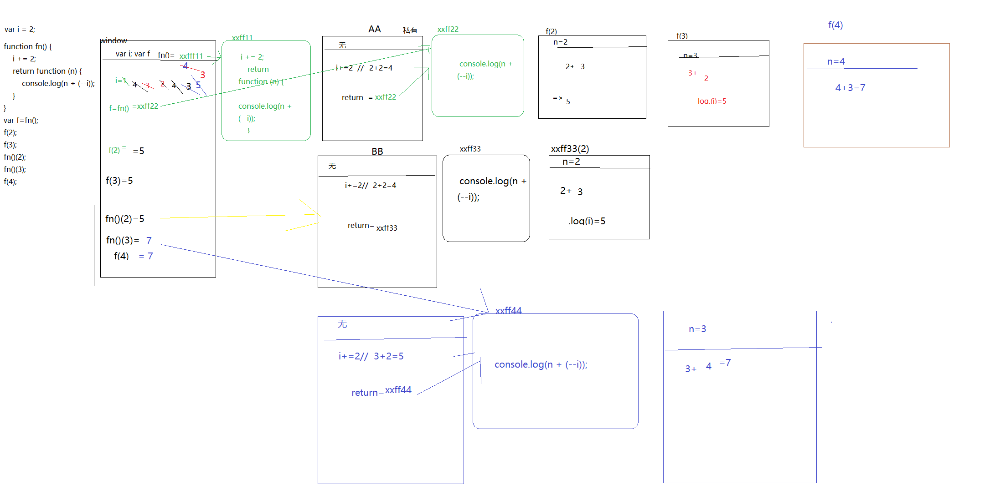

[TOC]
# 正式课第三天
##变量提升机制

### 只对等号左边进行变量提升
```Javascript
/*
 * 变量提升：
 *   var fn;   =>只对等号左边进行变量提升,等号右边是值是不进行变量提升的,
 *   sum = AAAFFF111;
 */
sum();
fn();//=>Uncaught TypeError: fn is not a function

//=>匿名函数之函数表达式
var fn = function () {
    console.log(1);
};//=>代码执行到此处会把函数值赋值给FN

fn();

//=>普通的函数
function sum() {
    console.log(2);
}

给匿名函数起名字没有实际用途,应为在函数外面无法获取这个函数名的
```
### 条件判断下的变量提升
在当前作用域下不管条件是否成立都要进行变量提升
=> 带var的还是只声明
=> 带function的在**老版本浏览器**渲染机制下,声明加定义都处理,但是为了迎合ES6中的块级作用域,**新版浏览器**对于函数(在条件判断中的函数)不管条件是否成立都是先声明,没有定义类似于var

```Javascript
/!*
 * 变量提升
 *   var a;  =>在全局作用域下声明的全局变量也相当于给WIN设置了一个属性 window.a=undefined
 *!/
console.log(a);//=>undefined
if ('a' in window) {
    var a = 100;
}
console.log(a);//=>100
*/

/*
 * 变量提升：无
 */
f = function () {return true;};//=>window.f=...（TRUE）
g = function () {return false;};//=>window.g=...（FALSE）
~function () {
    /*
     * 变量提升：
     *   function g;  //=>g是私有变量
     */
    if (g() && [] == ![]) {//=>Uncaught TypeError: g is not a function （此时的g是undefined）
        //=>[]==![]：TRUE
        f = function () {return false;};//=>把全局中的f进行修改 window.f=...（FALSE）
        function g() {return true;}
    }
}();
console.log(f());
console.log(g());
```
### 重名问题处理
1. 代var和function关键字声明相同的名字,这种也算是重名了(其实是一个fn,只是储存的值类型不一样)
2. 关于重名处理; 如果名字重复了不会重新声明,但会重新定义(重新负值)[不管是变量提升还是代码执行阶段皆是如此]
```Javascript
/*
 * 变量提升：
 *   fn = ...（1）
 *      = ...（2）
 *      = ...（3）
 *      = ...（4）
 */
fn();//=>4
function fn() {console.log(1);}
fn();//=>4
function fn() {console.log(2);}
fn();//=>4
var fn=100;//=>带VAR的在提升阶段只把声明处理了,赋值操作没有处理,所以在代码执行的时候需要完成赋值 FN=100
fn();//=>100() Uncaught TypeError: fn is not a function
function fn() {console.log(3);}
fn();
function fn() {console.log(4);}
fn();

```

### ES6中变量问题
1. 基于let和const 创建的变量或者函数,不存在变量提升机制. 切断了全局变量和window属性的映射机制(我们不可以在创建变量之前使用这些变量,让js语法更加严谨)

箭头函数也是函数
- 基于let和var创建变量,在私有变量和作用域链机制上是一样的

2. 在相同作用域当中基于let不能声明相同名字的变量(报错)
- 虽然没有变量提升机制,但是当前作用域代码自上而下执行前浏览器会做一个重复性检测(语法检测);自上而下查找当前作用域下所有变量,一旦发现有重复的,直接抛出异常,代码也不会在执行了()

3. 暂时性死区
- 基于let创建变量,会把大部分{}当做一个私有的块级作用域(类似于函数的私有作用域)在这里也要重新检测语法规范,看一下是否是基于新语法创建变量,如果是就按照新语法解析

在没有ES6,原有浏览器渲染机制下,基于typeof等逻辑运算符检测一个未被声明过得变量,不会报错,返回undefined.
如果当前变量是基于ES6语法处理,在没有声明这个变量的时候使用typeof检测会直接报错,不会是undefined,解决了原有的js死区问题

## 闭包作用域
### 全局变量和私有变量
1. 私有作用域中只有以下两种情况是私有变量:
- A: 声明过得变量(带var或者function)
- B: 形参也是私有变量

```Javascript
/*
 * 变量提升：
 *    var a;  var b;  var c;
 *    fn = xxx...
 */
var a = 12,
    b = 13,
    c = 14;

function fn(a) {
    /*
     * 形参赋值
     *   a = 12
     *
     * 变量提升
     *   var b;
     *
     * =>在私有作用域中，只有以下两种情况是私有变量
     *  A:声明过的变量(带VAR/FUNCTION)
     *  B:形参也是私有变量
     *
     *  剩下的都不是自己私有的变量，都需要基于作用域链的机制向上查找
     */
    console.log(a, b, c);//=>12 undefined 14(C是全局的)
    var b = c = a = 20;
    /*
     var b=20;
     c=20; =>把全局的C修改为20
     a=20;
     */
    console.log(a, b, c);//=>20*3
}

fn(a);//=>把FN执行(小括号中是实参:值) =>执行FN把全局变量A的值12当做实参传递给函数的形参 =>fn(12)
console.log(a, b, c);//=>12 13 20

```
### 查找上级作用域
> 当前函数执行,形成一个私有作用域A ,A的上级作用域是谁,和他在哪执行的没有关系和他在在哪创建(定义)的有关系,在哪创建的,他的上级作用域就是谁


```Javascript
var n = 10;

function fn() {
    var n = 20;

    function f() {
        n++;
        console.log(n);
    }

    f();
    return f;
}

var x = fn();
x();
x();
console.log(n);
```
### JS中的堆栈内存释放
JS中的内存分为堆内存和栈内存,
- 堆内存:存储引用类型值(对象:键值对 函数: 代码字符串)
- 栈内存: 提供JS代码执行的环境和存储基本类性值

[堆内存释放]
   让所有引用堆内存空间地址的变量赋值为null即可(没有变量占用这个堆内存了，浏览器会在空闲的时候把它释放掉）

[栈内存释放]
一般情况下,当函数执行完成时,所形成的的私有作用域(栈内存)都会自动释放掉,(在栈内存中存储的值也会被释放掉)保证浏览器告诉运转,但也有特殊不销毁情况
    1.函数执行完成，当前形成的栈内存中，某些内容被栈内存以外的变量占用了，此时栈内存不能释放（一旦释放外面找不到原有的内容了）
    2.全局栈内存只有在页面关闭的时候才会被释放掉

    如果当前栈内存没有被释放，那么之前在栈内存中存储的基本值也不会被释放，能够一直保存下来

    

```Javascript
var i = 1;
function fn(i) {
    return function (n) {
        console.log(n + (++i));
    }
}
var f = fn(2);
f(3);
fn(5)(6);
fn(7)(8);
f(4);


// var f=fn(2);//=>先把FN执行(传递实参2),把FN执行的返回结果(RETURN后面的值)赋值给F
// f();//=>把返回的结果执行
// fn(2)();//=>和上面两步骤类似，都是先把FN执行,把FN执行的返回结果再次执行
```
思考题
```Javascript
var k = 1;
console.log(5 + (++k) + (k++) + 4 + (k--) + (++k) + 3 + (--k) + (k++), k);
输出(26,3)

//=>在和其它值进行运算的时候有一些区别
// i++:自身累加1 （先拿原有值进行运算，运算结束后，本身累加1）
// ++i:自身累加1 （先自身累加1，拿累加后的结果进行运算）
/*
```

思考题

思路解析

```Javascript
var i = 2;
function fn() {
    i += 2;
    return function (n) {
        console.log(n + (--i));
    }
}
var f=fn();
f(2);         5
f(3);          5
fn()(2);        5 
fn()(3);        7
f(4);          7


```