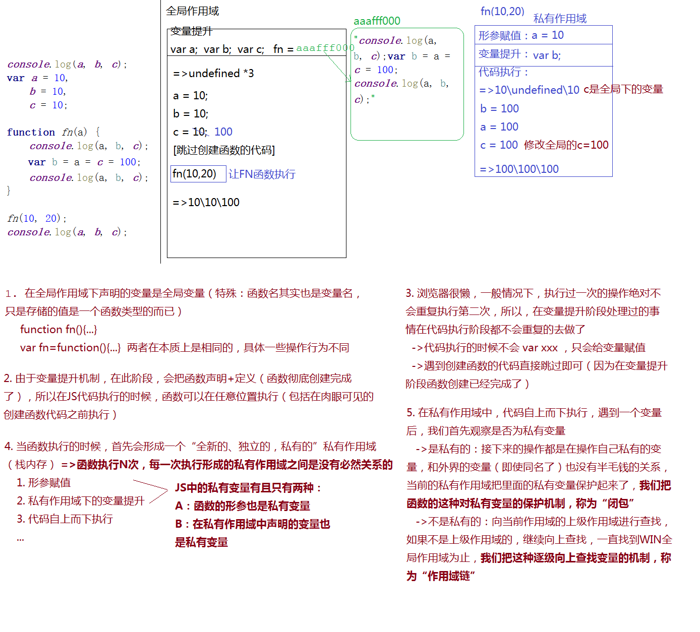
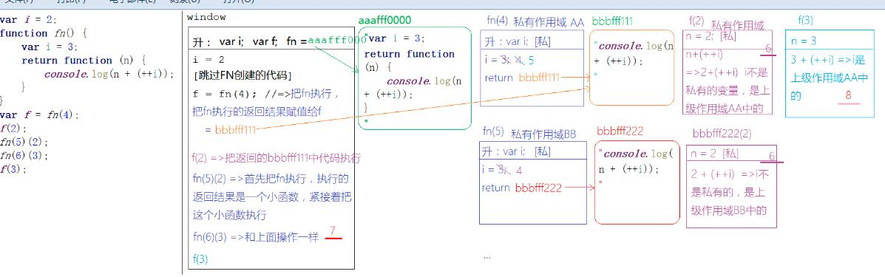
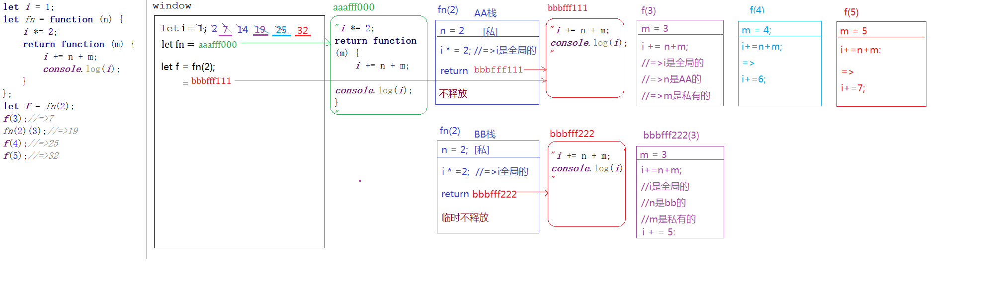

# 第四天
## 复习变量提升机制


**例子2**


**ES6闭包例子**

```Javascript
let i = 1;
let fn = function (n) {
    i *= 2;
    return function (m) {
        i += n + m;
        console.log(i);
    }
};
let f = fn(2);
f(3);//=>7
fn(2)(3);//=>19
f(4);//=>25
f(5);//=>32
```
###  闭包的应用
闭包: 函数执行形成一个私有的作用域,保护里面的私有变量不受外界干扰,这种保护机制称之为闭包.
<<<<<<< HEAD
市面上的开发者认为的闭包是:形成一个不销毁的私有作用域(私有内存)才是闭包

闭包:柯理化函数
=======
=>市面上的开发者认为的闭包是:形成一个不销毁的私有作用域(私有内存)才是闭包

// =>闭包:柯理化函数
>>>>>>> b9d2caa5ed521e0119da1b9b7b6d3a327c29892b
function fn(){
    return function(){

    }
}
var f = fn()

<<<<<<< HEAD
闭包:惰性函数
=======

//=> 闭包:惰性函数

>>>>>>> b9d2caa5ed521e0119da1b9b7b6d3a327c29892b
var utils = (function(){
    return {

    }
})();

<<<<<<< HEAD
 闭包项目实战应用
真实项目中为了保证JS的性能(堆栈内存的性能优化)应该可能减少闭包使用(不销毁的堆栈内存是消耗性能)
=======
//=> 闭包项目实战应用
    真实项目中为了保证JS的性能(堆栈内存的性能优化)应该竟可能减少闭包使用(不销毁的堆栈内存是消耗性能)
>>>>>>> b9d2caa5ed521e0119da1b9b7b6d3a327c29892b
1. 闭包具有保护作用:保护私有变量不受外界干扰
- 真实项目中尤其团队开发协作的时候,应当竟可能减少全局变量的使用,以防止相互之间的冲突(全局变量污染),那此时我们完全可以把自己这一部分内容封装到一个闭包中,让全局变量转化为私有变量

```javascript
(function () {
    var n = 12;
    function fn() {

    }

    //...
})();
```
- 不仅如此,我们封装类库插件的时候,也会把自己的程序存放到闭包中保护起来,防止和用户的程序冲突,但是我们又需要暴露一些方法给用户使用,这样我们如何处理呢??
    1. JQ这种方式: 把需要暴露的方法抛到全局
```javascript

/*
(function () {
    function jQuery() {
        //...
    }

    //...
    window.jQuery = window.$ = jQuery;//=>把需要供外面使用的方法，通过给WIN设置属性的方式暴露出去
})();
// jQuery();
// $();
*/

```
<<<<<<< HEAD
=======


>>>>>>> b9d2caa5ed521e0119da1b9b7b6d3a327c29892b
    2. Zepto这种方式:基于return 把需要共外面使用的方法暴露出去
```javascript
/*
var Zepto=(function () {
    //...
    return {
        xxx:function () {

        }
    };
})();
Zepto.xxx();
*/
```
<<<<<<< HEAD
2. 闭包具有保存作用:形成不销毁的栈内存,把一些值保存下来,方便后面的调取使用


**同步异步编程**
所有的事件绑定都是异步编程(同步编程:一件事一件事的做,当前这件事没玩成,下一个任务不能处理/ 异步编程:当天这件事没有彻底完成,不在等待,继续执行下面的任务) 绑定事件后,不需要等待执行继续执行下一个循环任务,所以当我们点击执行方法的时候,循环早已结束(让全局I等于循环后的最后结果3 )


 
 基于ES6的LET 来创建变量,是存在块级作用域的(类似于私有作用域)
=======

2. 闭包具有保存作用:形成不销毁的栈内存,把一些值保存下来,方便后面的调取使用


所有的事件绑定都是异步编程(同步编程:一件事一件事的做,当前这件事没玩成,下一个任务不能处理/ 异步编程:当天这件事没有彻底完成,不在等待,继续执行下面的任务) 绑定事件后,不需要等待执行继续执行下一个循环任务,所以当我们点击执行方法的时候,循环早已结束(让全局I等于循环后的最后结果3 )


//=>基于ES6的LET 来创建变量,是存在块级作用域的(类似于私有作用域)
>>>>>>> b9d2caa5ed521e0119da1b9b7b6d3a327c29892b
作用域:栈内存
1. 全局作用域
2. 私有作用域(函数执行)
3. 块级作用域(一般用大括号抱起来的都是块级作用域,前提基于ES6语法)