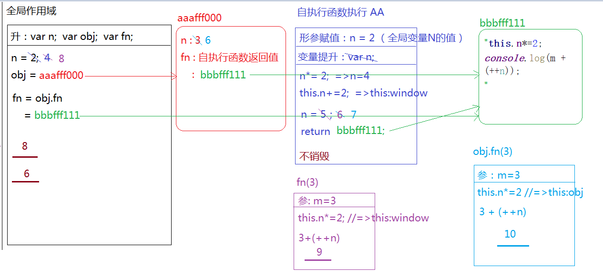
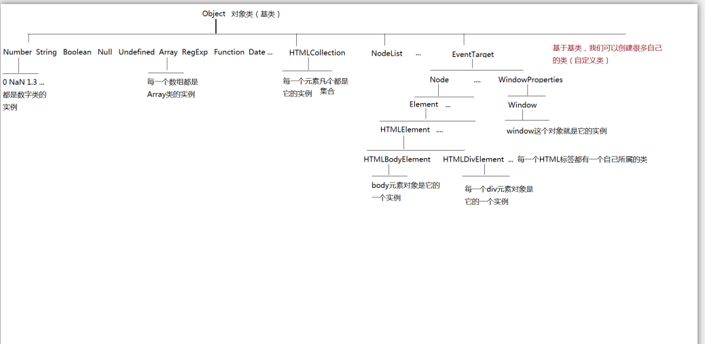
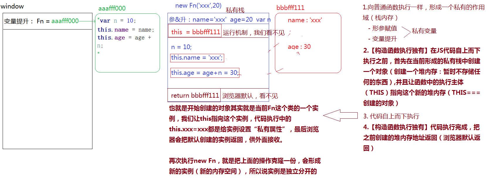
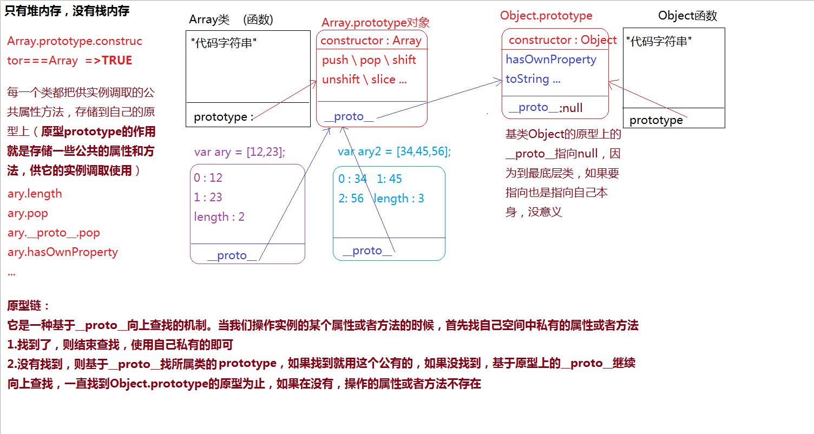

# 正式课 第五天 


### 1单例设计模式
 **单例模式(singleton pattern )**
> 1. 表现形式var obj= {
    xxxxx:xxx,
};
在单例设计模型中,OBJ不仅仅是对象名,他被称为"命名空间"[NameSpace],把描述事物的属性存放到命名空间中,多个命名空间是独立分开的,互不冲突.

> 2. 作用
> => 把描述同一件事物的属性和特征进行分组,归类(存储在同一个堆内存空间中),因此避免了全局变量之间的冲突和污染
> 3. 单利设计模式命名的由来
> => 每一个命名空间都是js中Object这个内置基类的实例,而实例之间是相互独立的互不干扰,所以我们称之为"单利":单例模式

**高级单例模式**

1. 再给命名空间赋值时,不是直接赋值一个对象,而是先执行匿名函数,形成一个私有作用域AA(不销毁的栈内存),在AA中创建一个堆内存,吧堆内存地址赋值给命名空间
2. 这种模式的好处: 我们完全可以在AA 中创造很多内容(变量OR函数),那些需要共外面调取使用的,我们暴露到返回的对象中(模块化实现得一种思想)



```Javascript
var n = 2;
var obj={
    n:3,
    fn:(function (n) {
        n*=2;
        this.n+=2;
        var n=5;
        return function (m) {
            this.n*=2;
            console.log(m + (++n));
        }
    })(n)//如果是(obj.n)// 报错
};
};
var fn = obj.fn;
fn(3);
obj.fn(3);
console.log(n, obj.n);

```

**基于单例模式模块化开发**
1. 团队协作开发的时候,会把产品按照功能板块进行划分,每一个功能板块有专人开发
2. 把各个板块之间公用的部分进行提取封装,后期在想实现这些功能,直接调取引用即可(模块封装)

### 2 工厂模式 (Factory Pattern)
> 1. 把实现相同功能的代码进行封装,以此来实现"批量生产".(后期想要实现这个功能,我们只需要执行函数即可)

> 2. 低耦合高内聚: 减少页面的冗余代码提高代码的重复使用率


## 面向对象OOP
> js 是一门编程语言(具备编程思想)
    [面向对象]
    - js
    - Java
    - php
    - c#
    - Ruby
    - Python
    - c++
    
    [面向过程]
    - c 

面向对象编 程,需要我们掌握: 对象,类,实例,的概念
- 对象; 万物皆对象
- 类: 对象的具体细分(按照功能特点进行分类:大类,小类)
- 实例: 类中具体的一个事物(拿出类别中的具体一个实例进行研究,那么当前类别下其他实例也具备这些特点和特征)


整个JS就是基于面向对象设计语言和开发出来的语言,我么学习和实战的时候也要按照面相对对象的思想去体会和理解

**js中的内置类**



### 基于构造函数创建自定义类(construction)
> 1. 在普通函数执行的基础上new xxx(),这样就不是普通函数执行了,而是构造函数执行,当前的函数名称之为"类名",接受的返回结果是当前类的一个实例
> 2. 自己创建的类名,最好第一个首字母大写
> 3. 这种构造函数设计模式执行,主要用于组件,类库,插件,框架等的封装,平常编写业务逻辑一般不这样处理
>function Fn (){
>
> }
> fn();//普通函数执行
> var f = new Fn();//=>Fn是类 f是类的一个实例
> var f2 = new Fn();//=>f2也是Fn的一个实例，f2和f是独立分开的，互不影响

**js中创建值有两种方式**
1. 字面量表达式
2. 构造函数模式
例如:
var obj = {};// 字面量方式
var obj = new Object();//=> 构造函数模式

//=> 不管是哪一种方式创造出来的都是Object类的实例,而实例之间是独立分开的,所以var xxx =()这种模式就是JS中的单例模式

 基本数据类型基于这两种不同模式创建出来的值是不一样的
1. 基于字面量方式创建出来的值是基本类型值
2. 基于构造函数创建出来的的值是引用类型
//>NUM2是数字类的实例,NUM1也是数字类型的实例,它只是JS表达数字的方式之一，都可以使用数字类提供的属性和方法
// var num1 = 12;
// var num2 = new Number(12);
// console.log(typeof num1);//=>"number"
// console.log(typeof num2);//=>"object"



**构造函数函数执行机制**
1.向普通函数一样形成一个私有作用域(栈内存)
- 形参赋值
- 变量提升 

2.构造函数独有: 在js 代码自上而下执行前,首先在当前形成的私有栈中创建一个对象(创建一个堆内存:暂时不存储任何东西),并且让函数中的执行主体(THIS)指向这个新的堆内存(this===>创建的对象)

3. 代码自上而下执行
4. 构造函数独有: 代码执行完成把之前创造的堆内存地址返回(浏览器默认返回)

//=> 也就是开始我们创建的对象其实就是当前Fn这个类的一个实例,我们让this指向这个实例,代码执行中的this.xxx=xxx都是给实例设置"私有属性",最后浏览器会把默认创建的实例返回,共外面接受

再次执行new Fn ,就是把上面的操作克隆一份,会形成新的实例(新的内存空间),所以说实例是独立分开的
```Javascript
构造函数执行
var f1 = new Fn('xxx', 20);
var f2 = new Fn('aaa', 30);

console.log(f1 === f2);//=>false：两个不同的实例（两个不同的堆内存地址）
console.log(f1.age);//=>30
console.log(f2.name);//=>'aaa'
console.log("name" in f1);//=>true name&age在两个不同的实例都有存储，但是都是每个实例自己私有的属性
console.log(f1.n);//=>undefined 只有this.xxx=xxx的才和实例有关系,n是私有作用域中的一个私有变量而已（this是当前类的实例）*/

// => 构造函数值执行,不写RETURN,浏览器会默认返回创建的实例,但是如果我们写了return?
// 1.return是的一个基本值，返回的结果依然是类的实例，没有受到影响
// 2.如果返回的是引用值，则会把默认返回的实例覆盖，此时接收到的结果就不在是当前类的实例了
 
//   =>构造函数执行的时候，尽量减少RETURN的使用，防止覆盖实例
function Fn() {
    var n = 10;
    this.m = n;
    // return;//=>这样RETURN是结束代码执行的作用，并且不会覆盖返回的实例
    // console.log(1);
}

var f = new Fn();//=>new Fn;  在构造函数执行的时候，如果Fn不需要传递实参，我们可以省略小括号，意思还是创建实例（和加小括号没有区别）
console.log(f);

```

**instanceof: 检测某一个实例是否隶属于这个类**
console.log(f instanceof Fn);//=>TRUE
console.log(f instanceof Array);//=>FALSE
console.log(f instanceof Object);//=>TRUE （万物皆对象：所有的对象，包含创建的实例都是Object的实例）

**in:检测当前对象是否存在某个属性(不管当前这个属性是对象的私有属性换是共有属性,只要有返回结果就是TURE)**
console.log('m' in f);//=>TRUE
console.log('n' in f);//=>FALSE
console.log('toString' in f);//=>TRUE toString是它的公有属性

 
**hasOwnProperty:检测当前属性是否为对象的私有属性(不仅要有这个属性,而且必须是私有的才可以)**
console.log(f.hasOwnProperty('m'));//=>TRUE
console.log(f.hasOwnProperty('n'));//=>FALSE 连这个属性都没有
console.log(f.hasOwnProperty('toString'));=>FALSE 虽然有这个属性但是不是私有的属性

```Javascript
//=>思考题：编写一个方法hasPubProperty，检测当前属性是否为对象的公有属性，和hasOwnProperty对应
function hasPubProperty(obj, attr) {
    //=>OBJ:要检测的对象
    //=>ATTR:要检测的属性
    //...
}
hasPubProperty(f, 'm');//=>FALSE
hasPubProperty(f, 'n');//=>FALSE
hasPubProperty(f, 'toString');//=>TRUE

```


**原型链设计模式**
原型(prototype),原型链(_proto_)
原型:每一个类都都把供实例调取的公共属性方法,储存到自己的原型上(原型prototype的作用就是存储一些公共的属性和方法,供其他实例调取使用)

原型链:他是一种基于__proto__向上查找的机制,当我们操作实例的某个属性或者方法的时候,首先找自己空间中的私有属性或者方法
1. 找到了,则查找结束使用自己私有即可
2. 没找到,则基于__proto__找所属类的prototype,如果找到就使用这个共有的,如果没找到,基于原型上的__proto__继续一直找到Obiect的原型为止,如果没有,操作的属性或者方法不存在
[函数]
     普通函数,类,(所有的类:内置类,自己创建的类)
[对象]
    普通对象,数组,正则,Math,
    实例对象类型的(除了基本类型的字面量创建的值)
    prototype得值也是对象类型的
    函数也是对象类型的
    .....
>

1. 所有的函数数据类型都天生再带一个属性:
prototype(原型),这个属性得值是一个对象,浏览器会默认给他开辟一个堆内存
2. 在浏览器给prototype开辟的堆内存中有一个天生自带属性:constructor,这个属性存储的值是当前函数本身
3. 每一个对象都有一个__proto__的属性,这个属性指向当前实例所属类prototype(如果不能确定他是谁的实例,都是Object的实例)

