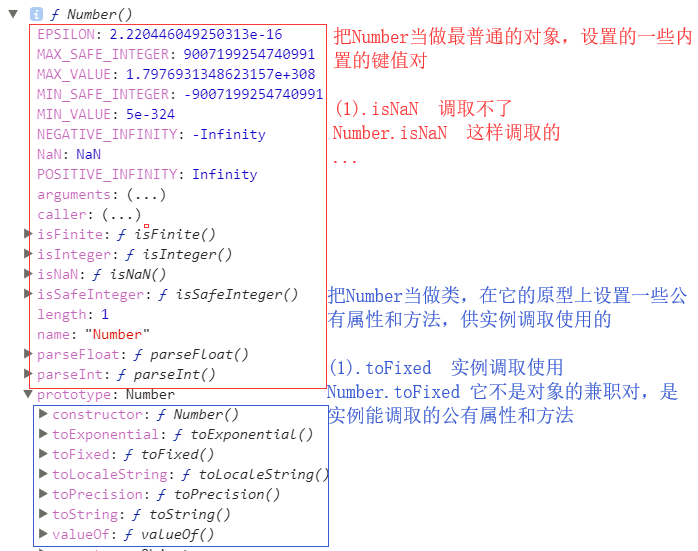

# 正式课第二周第二天
### 腾讯面试题
```javascript
function fun(){
   this.a=0;
    this.b=function(){
        alert(this.a);
    }
}
fun.prototype={
    b:function(){
        this.a=20;
        alert(this.a);
    },
    c:function(){
        this.a=30;
    }
}
var my_fun=new fun();
my_fun.b();
my_fun.c();
```

**知识点**
在实际项目基于面向对象开发的时候(构造原型设计模式),我们根据需要,很多时候会重定向类的原型(让类的原型指向自己开辟的堆内存)
[存在问题]
1. 自己开辟的堆内存中没有constructor属性,导致类的原型构造函数缺失(解决:自己手动在堆内存中增加constructor属性)
2. 当原型重定向后,浏览器默认开辟的的那个原型堆内存会被释放掉,如果之前已经存储了一些方法或者属性,这些东西会丢失(所以:内置类的原型不允许重定向到自己开辟的堆内存,应为内置类原型上自带很多属性和方法,重定向后都没了,这样是不被容许的)
下
私有属性:自己对内存中存储的属性相对于自己来说是私有的
公有属性:自己基于__proto__找到的属性相对于自己来说是公有的.

**扩展练习**
```javascript
function Fn() {
    var n = 10;
    this.m = 20;
    this.aa = function () {
        console.log(this.m);
    }
}
Fn.prototype.bb = function () {
    console.log(this.n);
};
var f1=new Fn;

Fn.prototype={
    aa:function(){
        console.log(this.m+10);
    }
};
var f2=new Fn;
console.log(f1.constructor);
console.log(f2.constructor);
f1.bb();
f1.aa();
f2.bb();
f2.aa();
f2.__proto__.aa();

```


### 数组去重
原理://[12,13,12,13,13,13,14]//=>依次遍历数组中的每一项,让每一项的值作为对象的属性名和属性值(属性值存啥都可以)，每一次存储之前验证当前对象中是否已经存在这个属性了(in/hasOwnProperty/属性值不是undefined...),如果有这个属性了,说明当前项在数组中已经存在了,我们把当前项在原有数组中移除即可,如果不存在,存储到对象中即可

**扩展**
原理:基于内置类的原型扩展方法,供他的实例调取使用
1. 我们增增加的方法最好设置"my"前缀(前缀是啥自己定),防止把内置方法重写


JS中的链式写法,:保证每一个方法执行返回结果依然是当前类的实例,这样就可以继续调取

```
Array.prototype.myUnique = function myUnique() {
    var obj = {};
    for (var i = 0; i < this.length; i++) {
        var item = this[i];
        obj.hasOwnProperty(item) ? (this[i] = this[this.length - 1], this.length--, i--) : obj[item] = item;
    }
    obj = null;
    return this;
};
var max = ary.myUnique().sort(function (a, b) {
    return a - b;
}).pop();
```
### 知识点原型深入函数有三种角色
- 1普通函数
    - -> 堆栈内存释放
    - ->作用域链
- 2类
    - prototype(原型)
    - __proto__(原型链)
    - 实例
- 3普通对象
    - 和一个普通的OBJ没啥区别:就是对键值对的增删改查.(函数可以向对象一样设置属于自己)
//=>三种角色没有必然关系
```Javascript
/*function Fn() {
    var n = 10;
    this.m = 100;
}

Fn.prototype.aa = function () {
    console.log('aa');
};
Fn.bb = function () {
    console.log('bb');
};*/
//=>普通函数
// Fn();//=>this:window  有一个私有变量n  和原型以及属性bb没有关系

//=>构造函数执行
// var f = new Fn;//=>this:f
// console.log(f.n);//=>undefined：n是私有变量和实例没有关系
// console.log(f.m);//=>100 实例的私有属性
// f.aa();//=>实例通过__proto__找到Fn.prototype上的方法
// console.log(f.bb);//=>undefined：bb是把Fn当做一个普通的对象设置的属性而已，和实例等没有半毛钱关系

//=>普通对象
// Fn.bb();

//============================================
//=>JQ这个类库中提供了很多的方法,其中有一部分是写在原型上的,有一部分是把它当做普通对象来设置的
~function () {
    function jQuery() {
        //...
        return [JQ实例]
    }
    jQuery.prototype.animate=function(){}
    //...
    jQuery.ajax=function(){}
    //....
    window.jQuery = window.$ = jQuery;
}();
// $().ajax() //=>调不了
// $().anaimte() //=>这样可以调取
// $.ajax() //=>直接的对象键值对操作
// $.animate() //=>对象上没有animate这个属性，这个属性在和实例相关的原型上
```
**number两种角色**


**Array的两种角色**


**阿里面题**

```javascript
function Foo() {
    getName = function () {
        console.log(1);
    };
    return this;
}
Foo.getName = function () {
    console.log(2);
};
Foo.prototype.getName = function () {
    console.log(3);
};
var getName = function () {
    console.log(4);
};
function getName() {
    console.log(5);
}

Foo.getName();//=>2 把Foo当做一个对象，找Foo的私有方法执行
getName();//=>4 执行全局下的GET-NAME
Foo().getName();//=>1 先把FOO当做普通函数执行,执行返回的结果在调取GET-NAME执行
getName();//=>1 执行的依然是全局下的GET-NAME

new Foo.getName();//=>A:(Foo.getName) =>new A()  =>2
new Foo().getName();//=>B:new Foo() =>B.getName() =>3
new new Foo().getName();//=>C:new Foo() =>new C[Foo的实例].getName() =>D:C.getName =>new D(); =>3  (先计算new Foo()创建一个实例f，然后new f.getName()，先找到f.getName，在把这个函数new一下，最后其实相当于把f.getName当做一个类，返回这个类的一个实例)


```
**例子函数三种角色运行机制**

```Javascript
function Fn() {
    this.n = 100;
}
Fn.prototype.getN = function () {
    console.log(this.n);
};
Fn.AA = 200;
var f=new Fn();

```


课后作业
一,
var ary=[12,23];  画出包括Function/Object/Array的原型图

二,
div -> HTMLDivElement ->HTMLElement ->Element ->Node ->EventTarget ->Object / Function
