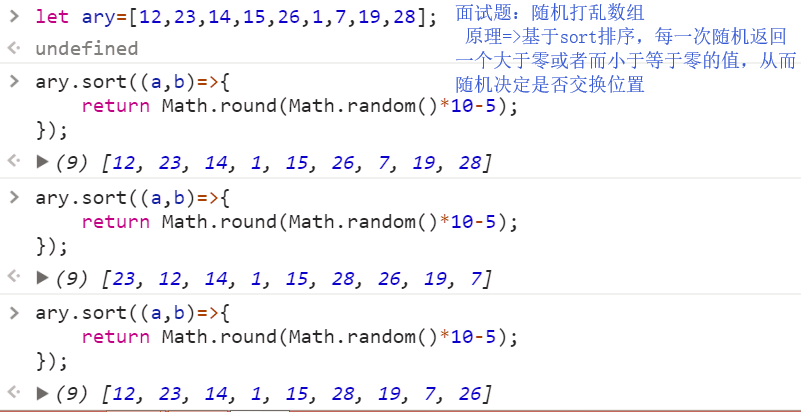

# 正式课第二周第五天
## 随机打乱数组


## 正则

> 定义:是用来处理字符串的规则

    1.正则只能用来处理字符串
    2.处理一般包含两个方面
        A:验证当前字符串是否符合某个规则"正则匹配"
        B:把一个字符串中符合规则的字符获取到"正则捕获"

> 学习正则其实就是在学习如何编写规则,每一个正则都是由"元字符"和"修饰符"两部分组成 1.创建正则的两种方式
> let reg1 = /^\d+$/g;//=>字面量方式
> let reg2 = new RegExp("^\\d+s","g");=>构造函数方式

2.正则两个斜杠之间包起来的都是"元字符",斜杠后面出现的都是"修饰符"
let reg1 = /^\d+$/g;

**常用的修饰符**

* i : ignoreCase 忽略大小写匹配
* m : multiLine 多行匹配
* g : global 全局匹配


**常用的元字符**
[特殊元字符]

* \d 0-9 之间的一个数字
* \D 除了 0-9 之间的任意数字
* \w 数字,字母,下划线中的任意一个
* \s 匹配任意一个空白字符(\t 制表符[TAB 键四个空格])
* \b 匹配边界符'zhu'(z 左边和 u 右边就是边界) 'zhu-feng'(z 左边、u 右边、f 左边、g 右边是边界)
* \n 匹配一个换行符
* \ 转译字符(把一个普通字符转译成特殊的字符,例如:\d 把有特殊含义的转化为普通意思,例如：\. 此处的点就不是任意字符，而是一个小数点)
* . 不仅仅是小数点，代表除了\n 以外的任意字符
* ^ 以某个元字符开头
* $ 以某个元字 符结尾
* x|y x 或者 y 中任意一个
* [xyz] x 或者 y 或者 z 中任意一个
* [^xyz] 除了 x\y\z 以外的任意字符
* [a-z] 获取 a-z 中的任意一个字符([0-9] 等价于\d..)
* [^a-z] 除了 a-z 的任意字符
* () 正则分组
* (?:)当前分组只匹配不捕获
* (?=) 正向预查
* (?!) 负向预查
* ...

[量词元字符 : 让其左边的元字符出现多次]

* *出现零到多次
* ?出现零到一次
* +出现一次到多次
* {n} 出现 N 次
* {n,} 出现 N 到多次
* {n,m} 出现 N 到 M 次

[普通元字符]
只要在正则中出现的元字符(在基于字面量方式创建),除了特殊和有量词意义的以外，其余的都是普通元字符

**[ ] 作用细节特点**
[xyz] x 或者 y 或者 z 中任意一个
[^xyz] 除了 x\y\z 以外的任意字符
[a-z] 获取 a-z 中的任意一个字符([0-9] 等价于\d..)
[^a-z] 除了 a-z 的任意字符
1. 中括号中出现的元字符一般都是代表本身含义的
>
2. 中括号中出现的两位数,不是两位数,而是两个数字中的任意一个
例如:年龄16-65之间
let arg = /^(1[89])|([2-5]\d)|(6[0-5])$/

**( )分组作用**
1. 改变默认优先级
2. 分组捕获
   
3. 分组引用

正则捕获使用的是正则中的exec方法
1.如果可以匹配获取的结果是一个数组,如果不能匹配获取的结果是NULL
2.如果我们只在匹配的时候,想要获取大正则中部分信息,我们可以把这部分使用小括号抱起来,形成一个小分组,这样在捕获的时候,不仅可以把大正则匹配的信息捕获到,而且还单独把小分组匹配的部分信息也捕获到了

常用正则表达式
```Javascript
有效数字:
规则:1,可以出现正负号,可以没有也可以有一个
 2,整数:一位或者多位,一位0-9,多位数字不能以0开头.
3.小数:可能有,可能没有,有小数点至少要跟一位数字
 
 // let reg = /^[+-]?(\d|([1-9]\d+))(\.\d+)?$/;
电话(手机)号码正则
1.11位数字
2.以1开头

// let reg = /^1\d{10}$/;


中文姓名
  1. 中文汉字  [\u4E00-\u9FA5]
  2. 尼古拉斯·赵四
// let reg = /^[\u4E00-\u9FA5]{2,}(·[\u4E00-\u9FA5]{2,})?$/;

 邮箱
 *   xxxx@xxx.xx.xx
 *
 *  第一部分：数字、字母、下划线、-、.，但是-和.不能作为开头，不能连续出现-或者.
 *
 *  第二部分：xxx.xx.xx  xxx.xx  xxx.xx.xx.xx  xxx-xxx-xx.xx.xx
 *
 */
//=>/^\w+((-\w+)|(\.\w+))*@[A-Za-z0-9]+((\.|-)[A-Za-z0-9]+)*\.[A-Za-z0-9]+$/

// let reg = /^\w+([-.]\w+)*@[A-Za-z0-9]+([-.][A-Za-z0-9]+)*(\.[A-Za-z0-9]+)$/;


```
