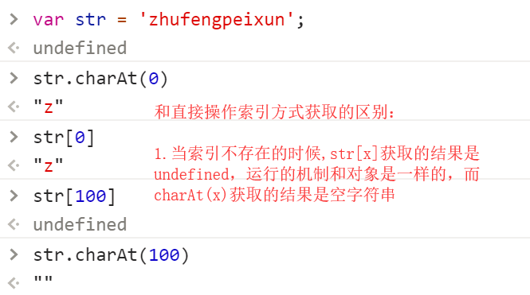
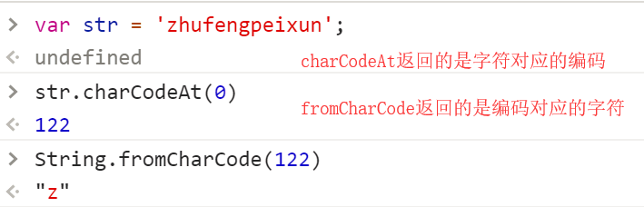
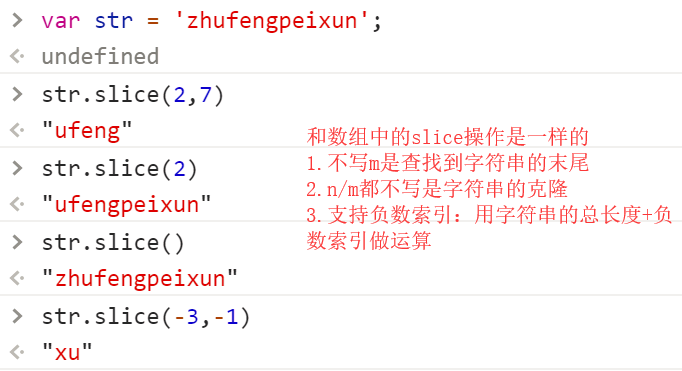
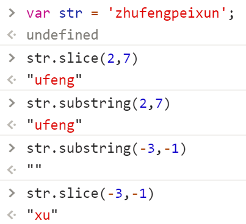
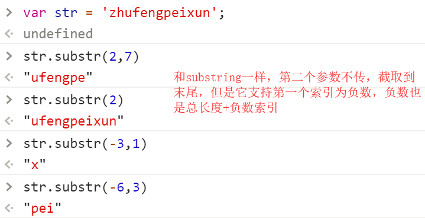
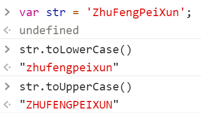
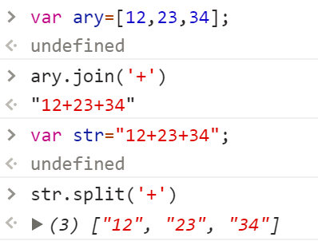

### JS中关于字符串的一些细节知识
> 在JS中所有用单引号或者双引号包起来的都是字符串，每一个字符串是由零到多个字符组成

```javascript
var str = 'zhufengpeixun';
str.length ->字符串长度
str[0] ->'z'
str[str.length-1] ->'n'
str[100] ->undefined

//=>字符串中的每一个字符都有一个自己对应位置的索引，也有类似于数组一样的length代表自己的长度

//=>循环遍历字符串，输出每一项字符
for(var i=0;i<str.length;i++){
   cosole.log(str[i]);
}
```

### 关于字符串中常用的方法
字符串是基本数据类型，字符串的每一次操作都是值直接的进行操作，不像数组一样是基于空间地址来操作的，所以不存在原有字符串是否改变这一说，肯定都是不变的

**`charAt/charCodeAt`**
作用：charAt根据索引获取指定位置的字符，charCodeAt不仅仅获取字符，它获取的是字符对应的Unicode编码值(ASC II码值)
参数：索引
返回：字符或者对应的编码



**`indexOf/lastIndexOf`**
基于这两个方法，可以获取字符在字符串中第一次或者最后一次出现位置的索引，有这个字符，返回大于等于零的索引，不包含这个字符，返回的结果是-1，所以可以基于这两个方法，验证当前字符串中是否包含某个字符
```javascript
var str='zhufengpeixun';
if(str.indexOf('@')>-1){
	//=>条件成立说明包含@符号
}
```

**`slice`**
作用：str.slice(n,m) 从索引n开始找到索引为m处(不包含m)，把找到的字符当做新字符串返回


**`substring`**
和slice语法一模一样，唯一的区别在于：slice支持负数索引，而substring不支持负数索引


**`substr`**
也是字符串截取的方法，用法是：str.substr(n,m)，从索引n开始截取m个字符


**`toUpperCase/toLowerCase`**
实现字母的大小写转换，toUpperCase小写转大写，toLowerCase大写转小写


**`split`**
和数组中的join相对应，数组中的join是把数组们一项按照指定的连接符变为字符串，而split是把字符串按照指定的分隔符，拆分成数组中每一项


**`replace`**
作用：替换字符串中的原有字符
参数：原有字符，要替换的新字符
返回：替换后的字符串
```javascript
//=>把“zhufeng”替换为“珠峰”
var str = 'zhufeng2017zhufeng2018';
str = str.replace('zhufeng','珠峰'); //=>在不使用正则的情况下，没执行一次replace只能替换一个 “珠峰2017zhufeng2018”
str = str.replace('zhufeng','珠峰'); //=>“珠峰2017珠峰2018”

//===================
str = str.replace(/zhufeng/g,'珠峰');
```

字符串中还有很多常用方法，回去后大家可以自己扩展一下：（String.prototype）
- includes
- localeCompare
- search
- trim
- ...

### 真实项目中的需求
`1.时间字符串格式化`
> 有一个时间字符串 “2018-4-4 16:26:8” ，我们想基于这个字符串获取到 “04月04日 16时26分”
```javascript
/*
 * 1.基于SPLIT按照空格把字符串拆成两部分(数组中的两项)
 * 2.左边这一部分继续以SPLIT按照中杠来拆
 * 3.右边这一部分继续以SPLIT按照冒号来拆
 * 4.把需要的信息拼接在一起即可（拼接的时候不足十位的补零）
 */
function addZero(val) {
    return val < 10 ? '0' + val : val;
}

var str = '2018-4-4 16:32:8';
var ary = str.split(' '),//=>["2018-4-4", "16:32:8"]
    aryLeft = ary[0].split('-'),//=>["2018", "4", "4"]
    aryRight = ary[1].split(':');//=>["16", "32", "8"]
var month = addZero(aryLeft[1]),
    day = addZero(aryLeft[2]),
    hour = addZero(aryRight[0]),
    minute = addZero(aryRight[1]);
var result = month + '月' + day + '日 ' + hour + '时' + minute + '分';
console.log(result);
```

暂时提高眼界的：
```javascript
~function (pro) {
    pro.formatTime = function (template) {
        template = template || '{0}年{1}月{2}日 {3}时{4}分{5}秒';
        var ary = this.match(/\d+/g);
        template = template.replace(/\{(\d+)\}/g, function () {
            var n = arguments[1],
                val = ary[n] || '0';
            val < 10 ? val = '0' + val : null;
            return val;
        });
        return template;
    }
}(String.prototype);
```

### URL地址问号传参解析
> 有一个URL地址“http://www.zhufengpeixun.cn/stu/?lx=1&name=AA&sex=man” 地址问号后面的内容是我们需要解析出来的参数信息
> {
>    lx:1,
>    name:'AA',
>    sex:'man'
> }

```javascript
/*
 * 1.先找到问号，把问号后面的信息截取下来即可
 *  A.首先我们需要验证是否存在#哈希值，存在我们从问号开始截取到#，不存在我们直接截取到字符串的末尾
 * 2.以&进行拆分(数组)
 * 3.遍历数组中的每一项，把每一项在按照=进行拆分，把拆分后的第一项作为对象的属性名，第二项作为属性值进行存储即可
 */
var str = 'http://www.zhufengpeixun.cn/stu/?lx=1&name=AA&sex=man#teacher';//=>#后面的称为哈希(HASH)值,这个值可能有可能没有,我们需要处理,有的话我们截取的时候需要过滤掉

//=>获取问号和井号在字符串中索引位置
var indexASK = str.indexOf('?'),
    indexWell = str.indexOf('#');
//=>#可能有可能没有
if (indexWell > -1) {
    //=>存在井号,我们截取到井号的位置即可
    str = str.substring(indexASK + 1, indexWell);
} else {
    //=>没有井号,我们截取到末尾即可
    str = str.substr(indexASK + 1);
}

//=>str='lx=1&name=AA&sex=man'
var ary = str.split('&'),//=>["lx=1", "name=AA", "sex=man"]
    obj = {};
for (var i = 0; i < ary.length; i++) {
    var item = ary[i],
        itemAry = item.split('=');
    //console.log(itemAry);//=>["lx", "1"]  ["name", "AA"] ...
    var key = itemAry[0],
        value = itemAry[1];
    obj[key] = value;
}
console.log(obj);//=>{lx: "1", name: "AA", sex: "man"}
```
提高眼界：
```javascript
~function (pro) {
    pro.queryURLParameter = function () {
        var obj = {},
            reg = /([^?=&#]+)(?:=([^?=&#]+)?)/g;
        this.replace(reg, function () {
            var key = arguments[1],
                value = arguments[2] || null;
            obj[key] = value;
        });
        return obj;
    }
}(String.prototype);

var str = 'http://www.zhufengpeixun.cn/stu/?lx=1&name=&sex=#teacher';
console.log(str.queryURLParameter());
```