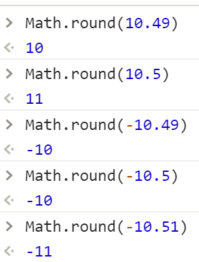

### JS中的数学函数Math
Math称为数学函数，但是它属于对象类型的
```javascript
typeof Math =>"object"
```
之所以叫做数学函数，是因为Math这个对象中提供了很多操作数字的方法

### Math中提供的常用方法
**`abs`**：取绝对值


**`ceil/floor`**：向上或者向下取整


**`round`**：四舍五入


**`sqrt`**：开平方


**`pow`**：取幂（N的M次方）


**`max/min`**：获取最大值和最小值


**`PI`**：获取圆周率


**`random`**：获取0~1之间的随机小数


`Math.round(Math.random()*(m-n)+n)`：获取n-m之间的随机整数

回去后可以自己扩展Math中更多方法