### 关于JS数组常用方法的剖析
数组也是对象数据类型的，也是由键值对组成的
```javascript
var ary = [12,23,34];
/*
 * 结构:
 *  0:12
 *  1:23
 *  2:34
 *  length:3 
 */
1. 以数组作为索引（属性名），索引从零开始递增
2. 有一个LENGTH属性存储的是数组长度

ary[0] 获取第一项
ary[ary.length-1] 获取最后一项
```
数组中每一项的值可以是任何数据类型的
```javascript
//=>多维数组
var ary = [
	{
	  name:'xxx',
	  age:20
	},
	{
	  name:'xxx',
	  age:20
	}
];
```

### 数组中的常用方法
> 按照四个维度记忆：
> - 方法的作用
> - 方法的参数
> - 方法的返回值
> - 原有数组是否改变

**`push`**
作用：向数组“末尾”追加新的内容
参数：追加的内容（可以是一个，也可是多个）
返回值：新增后数组的长度
原有数组改变
```javascript
var ary = [12,23,34];
ary.push(100); //=>4  ary:[12,23,34,100]
ary.push(100,{name:'xxx'}); //=>6  ary:[12,23,34,100,100,{...}]
```

**`pop`**
作用：删除数组最后一项
参数：无
返回：被删除的那一项内容
原有数组改变
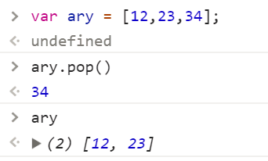

**`shift`**
作用：删除数组中的第一项
参数：无
返回：被删除的那一项内容
原有数组改变
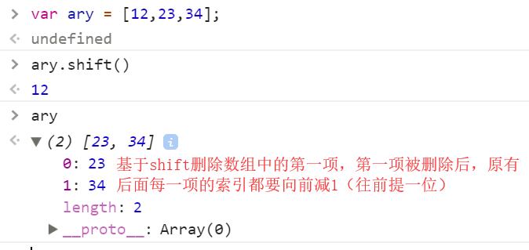

**`unshift`**
作用：向数组开始位置追加新内容
参数：要新增的内容
返回：新增后数组的长度
原有数组改变
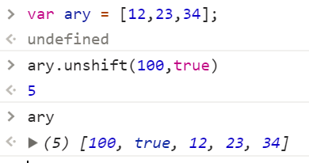

**`splice`**
基于 SPLICE可以对数组进行很多的操作：删除指定位置的内容、向数组指定位置增加内容、还可以修改指定位置的信息

`删除：ary.splice(n,m)`
从索引n开始，删除m个内容，把删除的部分以一个新数组返回，原有数组改变
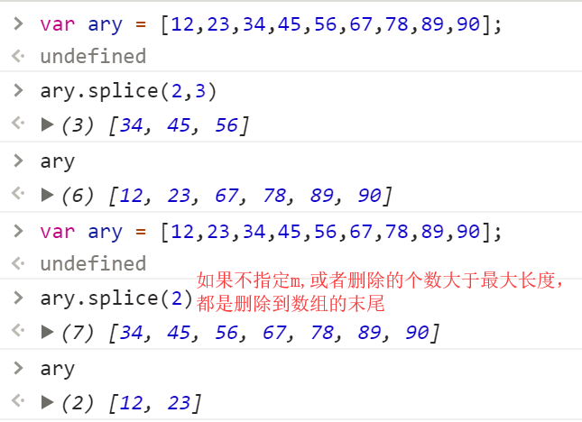

`新增：ary.splice(n,0,x,...)`
从索引n开始删除零项（没删除），把X或者更多需要插入的内容存放到数组中索引N的“前面”
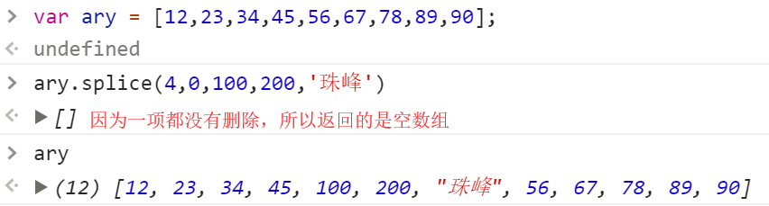

`修改：ary.splice(n,m,x,...)`
修改的原理就是把原有内容删除掉，然后用新的内容替换这部分信息即可
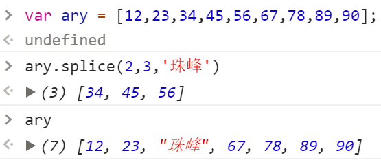

> 需求扩展：
> 1. 删除数组最后一项，你有几种办法?
> 2. 向数组末尾追加新内容，你有几种办法?
```javascript
//=>删除最后一项
ary.pop()
ary.splice(ary.length-1)
ary.length--

//=>向数组末尾追加新内容
ary.push(100)
ary.splice(ary.length,0,100)
ary[ary.length]=100
```
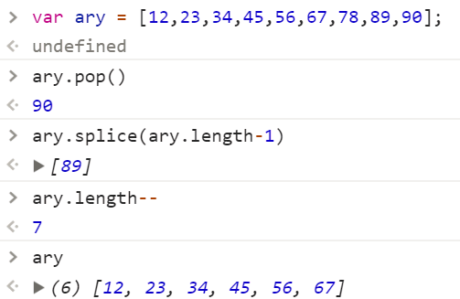
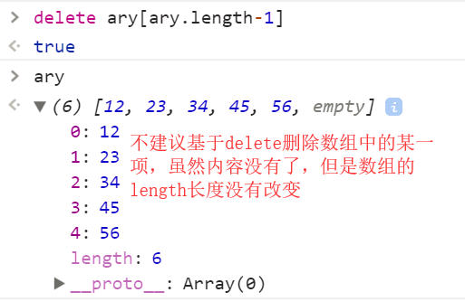

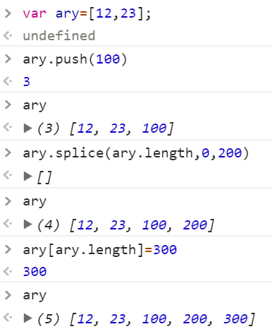

**`slice`**
作用：在一个数组中，按照条件查找出其中的部分内容
参数：两个参数（n/m），从索引n开始，找到索引m处，但是不包含m
返回：以一个新数组存储查找的内容
原有数组不会变
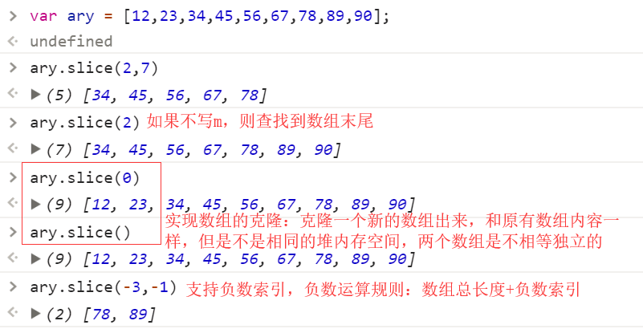

**`concat`**
作用：实现多个数组(或者值)的拼接
参数：数组或者值
返回：拼接后的新数组
原有数组不变
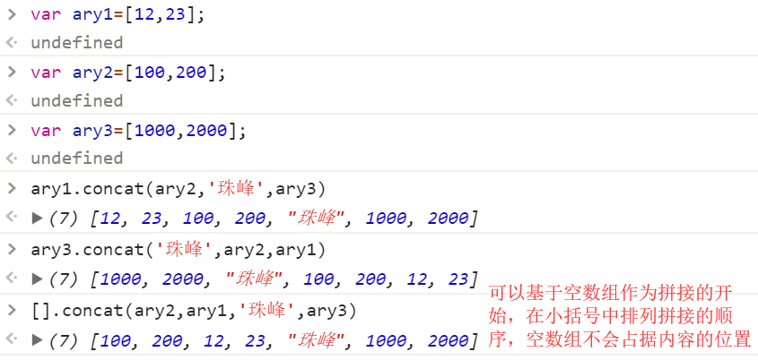

**`toString`**
作用：把数组转换为字符串
参数：无
返回：数组中的每一项用逗号分隔的字符串
原有数组不变 

**`join`**
作用：和toString类似，也是把数组转换为字符串，但是我们可以设置变为字符串后，每一项之间的连接符
参数：指定的链接符
返回：字符串
原有数组不变 
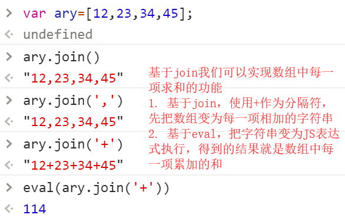

**`reverse`**
作用：把数组倒过来排列
参数：无
返回：排列后的新数组
原有数组改变
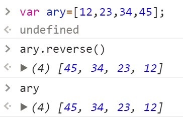

**`sort`**
作用：给数组排序
参数：无/函数
返回：排序后的新数组
原有数组改变

```javascript
//=>sort在不传递参数的情况下，只能处理10以内数字排序
var ary=[1,3,2,4,5,6,7,9,8];
ary.sort(); =>[1,2,3,4,5,6,7,8,9]

var ary=[18,1,23,27,2,35,3,56];
ary.sort(); =>[1, 18, 2, 23, 27, 3, 35, 56] 没有按照我们想象中的排序

//=>真实项目中，基于sort排序，我们都需要传递参数
var ary=[18,1,23,27,2,35,3,56];
ary.sort(function (a,b){
	return a-b;//=>升序  return b-a; 降序
});
```

**`indexOf / lastIndexOf`**
这两个方法不兼容IE低版本浏览器(IE6~8)
作用：检测当前值在数组中第一次或者最后一次出现位置的索引
参数：要检测的值
返回：索引
原有数组不变
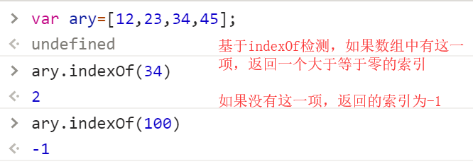

```javascript
//=>验证数组中是否包含某一项
if(ary.indexOf(100)>-1){
   //=>ARY中包含100这一项
}
```

除了以上方法，数组中还包含很多常用的方法（Array.prototype）
- every
- filter
- find
- forEach
- includes
- keys
- map
- reduce / reduceRight
- some
- ...

第一阶段咱们不深入研究这些方法，搞懂这些方法需要了解OOP/作用域/回调函数等，第二阶段咱们在去研究这些