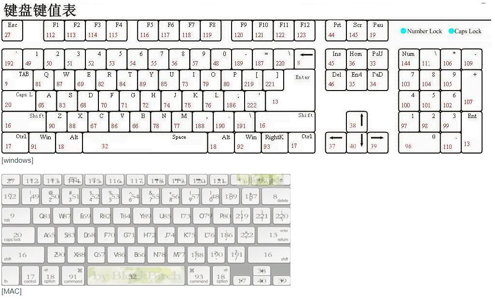

# 正式课第五周 事件
## 事件
1.什么是事件
> 事件就是一件事情或者一个行为(对于元素来说,他的很多事件都是天生自带的)只要我们去操作这个元素,就会触发这个行为
> 事件就是元素天生自带的行为,我们操作元素,就会触发相关的事件行为
> oBox.onclick=function(){}

2.事件绑定
> 给元素天生再带的事件行为绑定方法,当事件触发,会把对应的方法执行

3.元素天生自带的事件
[鼠标事件]
click:点击(PC端是点击,移动端代表单击[移动端click会有300ms延迟问题])
dblclick: 双击
mouseover: 鼠标经过
mouseout: 鼠标移出
mouseenter: 鼠标进入
mouseleave: 鼠标离开
mousemove : 鼠标移动
mousedown: 鼠标按下 (鼠标左右件都能起作用,他是按下即触发.click是按下抬起来才会触发,而且是先把down和up触发,才会触发click)
mouseup:鼠标抬起 
mousewheel: 鼠标滚轮滚动

[键盘事件]
keydown: 键盘按下
keyup: 键盘抬起
keypress: 和keydown类似,只不过keydown返回的是键盘码 , keypress返回的是ASCII码值
input:由于PC端有实体物理键盘,可以坚听到按下和抬起,但是移动端是虚拟键盘,所以keydown和keyup在大部分手机都没有,我们使用input事件统一代替他们(内容改变事件)

[表单元素常用事件]
focus : 获取焦点
blur: 失去焦点
change: 内容改变

[其他常用事件]
load: 加载完成
unload: 
beforeunload
scroll: 滚动条滚动事件
resize: 大小改变事件  window.onresize=function(){} 当浏览器窗口大小发生改变，会触发这个事件，执行对应的事情

[移动端手指事件]
[touch：单手指操作]
touchstart: 手指按下
touchmove: 手指移动
touchend: 手指离开
touchcancel: 因意外情况导致手指操作取消

[gesture多手指]
gesturestart: 手指按下
gesturechange: 手指改变
gestureend: 手指离开


[H5中的AUDIO/Video 音视频事件]
canplay:可以播放(播放过程中可能出现由于资源没有加载完成,导致卡顿)
canplaythrough: 资源加载完成,可以正常无障碍播放

box.onclick = function () {
    console.log('click');
 };
 box.onmousedown = function () {
     console.log('down');
 };
 box.onmouseup = function () {
     console.log('up');
 };

 tempInp.onkeydown = function () {
     console.log('ok');
 };


### 事件绑定
目的: 给当前元素的某个事件绑定方法(不管是DOM0换是DOM2),都是为了触发元素的相关行为的时候,能做点事情(也就是把绑定的方法执行),'不仅把方法执行了,而且浏览器还给方法传递了一个实参信息值====>这个值就是事件对象'
**DOM0级事件绑定**
[element].onxxx= function(){}
**DOM2级事件绑定**
[element].addEventListener('xxx',function(){},false);
[element].attachEvent('onxxx',function(){}); [IE6~8]

**事件对象及兼容**
box.onclick = function (ev) {
=>定义一个形参EV用来接收方法执行的时候，浏览器传递的信息值（事件对象：MouseEvent鼠标事件对象、KeyboardEvent键盘事件对象、Event普通事件对象...）

目的:事件对象当中记录了很多属性名和属性值,这些信息中包含了当前操作的基础信息,例如:鼠标点击位置的X/Y轴坐标,鼠标点击的是谁(事件源)等信息
[MouseEvent]
ev.target => 事件源(操作的是那个元素)
ev.clientX/ev.clientY  :当前鼠标触发点距离当前窗口左上角的X/Y坐标
ev.pageX / ev.pageY：当前鼠标触发点距离BODY(第一屏幕)左上角的X/Y轴坐标
 ev.preventDefault()：阻止默认行为
 ev.stopPropagation()：阻止事件的冒泡传播
 ev.type：当前事件类型

[KeyboardEvent]
ev.code：当前按键'keyE'
ev.key：当前按键'e'
ev.which / ev.keyCode：当前按键的键盘码 69
let code = ev.which || ev.keyCode;
}

常用的键盘码
左 37
上 38
右 39
下 40

backspace: 8
Enter : 13
Space 空格: 32
Delete: 46
Shift: 16
Alt: 18
Ctrl: 17
ESC; 27

F1-F12: 112--123
0-9:  48--57
小写字母: 65--90 


**IE6-8兼容**
```javascript
box.onclick = function (ev) {
    //=>在IE低版本浏览器中，浏览器执行绑定的方法，并没有把事件对象传递进来，此时ev===undefined，需要基于window.event来获取（由于是全局属性，鼠标每次操作都会把上一次操作的值替换掉）
    if (!ev) {
        //=>低版本中没有的属性，我们手动设置一下：按照自己有的先获取到值，然后赋值给和标准对应的新属性（经过判断处理后，低版本中也有TARGET/PAGE-X/PAGE-Y这些属性了），后期再使用的时候，直接按照高版本的使用即可
        ev = window.event;
        // console.log(ev.srcElement);//=>ev.srcElement是获取事件源（标准中使用的是ev.target）
        ev.target = ev.srcElement;
        // console.log(ev.pageX);//=>低版本浏览器的事件对象中不存在pageX/pageY
        ev.pageX = ev.clientX + (document.documentElement.scrollLeft || document.body.scrollLeft);
        ev.pageY = ev.clientY + (document.documentElement.scrollTop || document.body.scrollTop);
        ev.which = ev.keyCode;

        // preventDefault & stopPropagation 这些在低版本下都没有
        ev.preventDefault = function () {
            ev.returnValue = false;//=>低版本阻止默认行为
        };
        ev.stopPropagation = function () {
            ev.cancelBubble = true;//=>低版本阻止冒泡传播
        };
    }
    //=>直接按照高版本的规则来使用即可
    console.log(ev.target, ev.which);
    ev.preventDefault();
    ev.stopPropagation();
};

box.onclick = function (ev) {
    //=>用到谁给谁处理兼容
    ev = ev || window.event;
    var target = ev.target || ev.srcElement;
    ev.preventDefault ? ev.preventDefault() : ev.returnValue = false;
};
```

### 事件的默认行为
事件本身就是天生就有的,某些事件触发,即使你们没有绑定方法,也会存在一些效果,这些默认的效果就是"事件的默认行为"

A标签的点击操作就存在默认行为
1.页面跳转
2.锚点定位(HASH定位[哈希定位])

<a href="http://www.zhufengpeixun.cn/" target="_blank">
        珠峰培训
     </a>
     target='_blank'：让其在新窗口打开

 <a href="#box">珠峰培训</a> 首先会在当前页面URL地址栏末尾设置一个HASH值，浏览器检测到HASH值后，会默认定位到当前页面中ID和HASH相同的盒子的位置（基于HASH值我们还可以实现SPA单页面应用）


InPUt 标签也有自己的默认行为
1.输入内容可以呈现在文本框中
2.输入内容的时候会把之前输入的一些信息呈现出来(并不是所有的浏览器和所有情况都有)

suBMIT按钮存在默认行为
1. 点击按钮页面会刷新
<form action="http://www.zhufengpeixun.cn/">
            <input type="submit" value="提交">
        </form>
在FORM中设置ACTION，点击SUBMIT，会默认按照ACTION指定的地址进行页面跳转，并且把表单中的信息传递过去（非前后端分离项目中，由服务器进行页面渲染，由其它语言实现数据交互，一般都是这样处理）

 ...

**阻止事件默认行为**
1.阻止A标签的默认行为: 很多后我们使用A标签仅仅是想当做一个普通的按钮,点击实现一个功能，不想页面跳转，也不想锚点定位

在结构中阻止
<a href="javascript:;">珠峰培训最新全栈视频，等你来拿~~</a>
  javascript:void 0/undefined/null...;

在JS中也可以阻止  
给其CLICK事件绑定方法，当我们点击A标签的时候，先触发CLICK事件，其次才会执行自己的默认行为

link.onclick = function (ev) {
    ev = ev || window.event;
     return false;
 };

 link.onclick = function (ev) {
     ev = ev || window.event;
     ev.preventDefault ? ev.preventDefault() : ev.returnValue = false;
 };

 tempInp.onkeydown = function (ev) {
     // ev = ev || window.event;
     // ev.preventDefault ? ev.preventDefault() : ev.returnValue = false;
    return false;
 };
 ```Javascript
 tempInp.onkeydown = function (ev) {
    ev = ev || window.event;

    let val = this.value.trim(),//=>TRIM去除字符串首位空格(不兼容) this.value=this.value.replace(/^ +| +$/g,'')
        len = val.length;
    if (len >= 6) {
        this.value = val.substr(0, 6);

        //=>阻止默认行为去除特殊按键（DELETE\BACK-SPACE\方向键...）
        let code = ev.which || ev.keyCode;
        if (!/^(46|8|37|38|39|40)$/.test(code)) {
            ev.preventDefault ? ev.preventDefault() : ev.returnValue = false;
        }
    }
};

 ```
 ### 事件的传播机制
 #### 冒泡传播:
  触发当前元素的点击事件行为,不仅当前元素事件行为触发,而且其祖先元素相关事件行为也会被依次触发,这种机制就是"事件的冒泡传播机制"

 1.捕获阶段,
 点击INNER的时候,首先会从最外层开始向内查找(找到操作的事件源),查找的目的是,构建出冒泡传播阶段需要传播多的路线,(查找就是按照HTML的层级结构来找的)

 2.目标阶段
 把事件源的相关操作行为触发(如果绑定了方法则把方法执行)

 3.冒泡传播
 把当前事件源的祖先元素的相关事件行为依次触发(如果某一个祖先元素事件行为绑定了方法,则把方法执行,没绑定方法,行为触发了,什么都不错,继续向上传播即可)

 xxx.onxxx=function(){}  DOM0事件绑定，给元素的事件行为绑定方法，这些方法都是在当前元素事件行为的冒泡阶段(或者目标阶段)执行的

xxx.addEventListener('xxx',function(){},false)  第三个参数FALSE也是控制绑定的方法在事件传播的冒泡阶段(或者目标阶段)执行；只有第三个参数为TRUE才代表让当前方法在事件传播的捕获阶段触发执行（这种捕获阶段执行没啥实际意义，项目中不用）；


**不同浏览器对于最外层祖先元素的定义是不一样的**
谷歌: window=>document=>HTML=>body...
IE高:window=>HTML=>body...
IE低:HTML=>body...

关于事件对象的一些理解
1.事件对象是用来存储当前操作的相关信息的,和操作有关,和元素无必然联系
2.当我们基于鼠标或者键盘等操作的时候,浏览器会把本次操作信息存储起来(标准浏览器存储到默认的内存中(自己找不到),IE低版本存储到window.event中了),存储的值是一个对象(堆内存);操作肯定会触发元素的某个行为,也会把绑定的方法执行,此时浏览器会把之前存储的对象(准确的说是内存地址)当做实参传递给每一个执行的方法,所以操作一次,即使在多方法中都有ev,但是存储得值都是一个（本次操作信息的对象而已）


####  mouseover: 鼠标经过 mouseenter: 鼠标进入 区别
1.over属于划过(覆盖)事件,从父元素进入子元素,属于离开了父元素,会触发父元素的out,触发子元素的over
    enter属于进入,从父元素进入子元素,并不算离开父元素,不会触发父元素的leave,触发子元素的enter
2.enter和leave阻止了事件的冒泡传播,而over和out还存在冒泡传播

所以对于父元素嵌套子元素这种情况,使用over会发生很多不愿意操作的事情,此时我们使用ENTER会更加简单,操作方便,所以真实项目中使用enter会比over多
