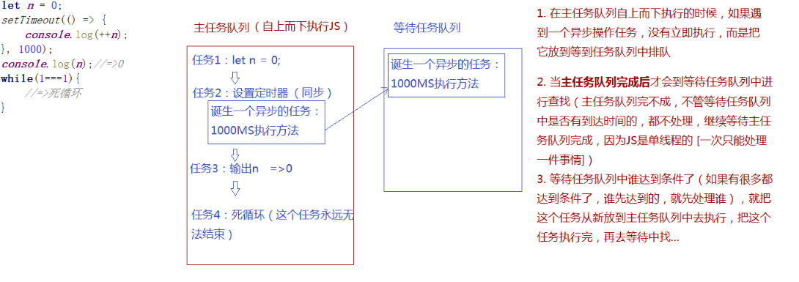

# 正式课第四周 定时器 同异步编程
## JS中的定时器
> 定时器: 设定一个定时器,并且设定了等到的时间,当到达执定的时间,浏览器会把对应的方法执行
[常用定时器]
setTimeout ([function][interval])
> 执行一次的定时器
```Javascript
let count = 0;
 setTimeout(() => {
     count++;
 }, 1000);
```

setInterval  ([function][interval])
>可执行多次的定时器: 每间隔INTERVAL这么长的时间，都会把设定的方法重新执行一次，直到定时器被清除
```Javascript
 let count = 0;
setInterval(() => {
    count++;
    console.log(count);
}, 1000);

```
function: 到达时间后执行的方法(设定定时器的时候方法没有执行,当时间后方法帮我们执行)
interval: 时间因子,(需要我们等到的时间 MS)

=>清除定时器
clearTimeout / clearInterval：这两个方法中的任何一个都可以清除用任何方法创建的定时器
1.设置定时器会有一个返回值，这个值是一个数字，属于定时器的编号，代表当前是第几个定时器（不管是基于setTimeout还是setInterval创建定时器，这个编号会累加）
2.clearTimeout([序号])/clearInterval([序号])：根据序号清除浏览器中设定的定时器
```Javascript
 let count = 0;
 let timer = setInterval(() => {
     count++;
     console.log(count);
     if (count === 5) {
         //=>清除定时器
        clearTimeout(timer);
     }
 }, 1000);
```
### 同步 异步编程
同步编程: 任务是按照顺序依次处理,当这件事没有做完,下一件事是执行不了的
异步编程: 当前这件事没有彻底做完，需要等待一段时间才能继续处理，此时我们不等，继续执行下面的任务，当后面的任务完成后，再去把没有彻底完成的事情完成

js中的异步编程:
1. 所有事件绑定是异步编程   xxx.onclick=function(){}
2. 所有的定时器是异步编程   setTimeout(function(){},1000)
3. AJAX中一般都使用异步编程处理
4. 回调函数也算是异步编程

定时器设定一个时间,到达时间后不一定执行(如果当前还有其他同步任务正在处理,那么到时间了也定等着)

### 浏览器是如何规划同步和异步机制的
1.浏览器是多线程的,JS是单线程的(浏览器只给JS执行分配一个线程)单线程的特点就是一次只能处理一件事情

    进程:每个应用程序都可以理解为一个进程(浏览器打开一个页面就相当于开辟一个进程),在一个程序中我们经常会同时干很多事情,此时我们可以分配多个线程去同时完成多项任务.

2.JS在单线程中实现异步机制,主要依赖于浏览器的任务队列完成的,浏览器中有两个任务队列(主要任务对列和等在任务对例)
>- 1,在主任务自上而下执行的时候,如果遇到一个异步操作任务,没有立即执行,而是把它存放到等到任务队列中排队
>- 2.当主任务队列完成能后才会到等待任务对列中进行查找(主任务对列不完成,不管等待任务队列中是否有到达时间的,都不处理,继续等待主任务队列完成,应为JS是单线成的[一次只能处理一件事情])
>- 3.等待任务队列中谁达到条件了(如果很多都达到了条件,谁先达到的,就先处理谁),就把这个任务从新放到主任务队列中去执行,把这个任务执行完,再去等待中找....
**示例**


定时器时间因子设置为零也不是立即执行，每个浏览器都有一个自己最小的等待和反应时间（谷歌：5~6  IE：10~13），所以写零还是异步编程
let n = 0;
setTimeout(() => {
   console.log(++n);
 }, 0);
 console.log(n);


思考题:
```Javascript
setTimeout(() => {
    console.log(1);
}, 20);
console.log(2);
setTimeout(() => {
    console.log(3);
}, 10);
console.log(4);
for (let i = 0; i < 90000000; i++) {

}
console.log(5);
setTimeout(() => {
    console.log(6);
}, 8);
console.log(7);
setTimeout(() => {
    console.log(8);
}, 15);
console.log(9);
```
### 初识Promise(ES6语法)
> 他是ES6 中新增加的类(new Promise), 目的是为了管理JS中的异步编程单位,所以我们也把它称为Promise设计模式
三个状态:
1. pending (准备状态:初始化成功,开始执行异步的任务)
2. fulfilled (成功)
3. rejected   (失败)
>new Promise(() => {
     //=>执行一个异步的任务（new Promise的时候，创建Promise的一个实例，立即会把当前函数体中的异步操作执行） =>“Promise是同步的，它可以管理异步操作”
### 封装动画库
动画: 能动的图片文字
1.CSS3 动画
    -transition =过度动画
   - animation 帧动画
   - transform 是变形不是动画(经常依拖一种动画让元素在一定时间内实现编译效果)
2.JS动画
    - 定时器
    - requestAnimationFrame(JS中的帧动画)
    - 所谓的canvas动画就是JS基于定时器完成(canvas是一个HTML标签,可以理解为是一个画布)
    - FLASH动画（ActionScript）


### 回调函数
> 把一个函数A当做实参传递给另一个函数B,在B方法执行的时候,把A执行了我们把这种机制叫做"回调函数机制"
1.根据需求回调函数可以被执行N多次
2.不仅可以把回调函数执行,换可以给传递的回调函数传递实参,这样在回调函数中设置形参（或者使用ARG）接收即可
3.还可以改变回调函数中的THIS指向
4.可以在宿主函数（它在哪执行的，它的宿主函数就是谁）中接收回调函数执行的返回结果


